Table of Contents
=================

   * [01-Introduzione ai sistemi di elaborazione.txt](#01-introduzione-ai-sistemi-di-elaborazionetxt)
      * [Vantaggi:](#vantaggi)
      * [Un sistema a processore utilizza 3 idee chiave:](#un-sistema-a-processore-utilizza-3-idee-chiave)
      * [Ere dei calcolatori:](#ere-dei-calcolatori)
      * [- Generazioni:](#--generazioni)
      * [Legge di Moore:](#legge-di-moore)
      * [(Negli ultimi anni inizia ad esserci qualche dubbio.)](#negli-ultimi-anni-inizia-ad-esserci-qualche-dubbio)
      * [CISC vs RISC vs SUPERSCALARI vs MULTICORE:](#cisc-vs-risc-vs-superscalari-vs-multicore)
      * [FAMIGLIE E COMPATIBILITA'](#famiglie-e-compatibilita)
      * [MICROCONTROLLORI (MCU):](#microcontrollori-mcu)
      * [Da qui nasce l'idea di microcontrollori, dispositivi integrati su un unico IC composti da:](#da-qui-nasce-lidea-di-microcontrollori-dispositivi-integrati-su-un-unico-ic-composti-da)
      * [REALIZZAZIONE DI SISTEMI SPECIAL-PURPOSE:](#realizzazione-di-sistemi-special-purpose)
      * [- SOLUZIONE HW: ASIC (Application Specific IC):](#--soluzione-hw-asic-application-specific-ic)
   * [02-Processori.txt](#02-processoritxt)
   * [03-Introduzione ad assembler](#03-introduzione-ad-assembler)
      * [COSTANTI:](#costanti)
      * [Ne esistono ovviamente altri del tipo:](#ne-esistono-ovviamente-altri-del-tipo)
      * [RAPPRESENTAZIONE DELLE PAROLE (little endian)](#rappresentazione-delle-parole-little-endian)
      * [BOOT](#boot)
      * [MODI DI INDIRIZZAMENTO](#modi-di-indirizzamento)
   * [04-Segmentazione e indirizzi.txt](#04-segmentazione-e-indirizzitxt)
   * [04A-Input_Output di un vettore di caratteri.txt](#04a-input_output-di-un-vettore-di-caratteritxt)
      * [Output di un carattere:](#output-di-un-carattere)
   * [05-Istruzioni-trasferimento-dati](#05-istruzioni-trasferimento-dati)
      * [XCHG:](#xchg)
      * [LEA:](#lea)
      * [STACK (PUSH, POP):](#stack-push-pop)
   * [05A-Istruzioni-aritmetiche](#05a-istruzioni-aritmetiche)
      * [In breve:](#in-breve)
   * [06-Istruzioni-Aritmetiche](#06-istruzioni-aritmetiche)
      * [CWD (](#cwd-)
      * [ciclo:](#ciclo)
      * [continua:](#continua)
   * [07-Istruzioni-di-controllo del flusso](#07-istruzioni-di-controllo-del-flusso)
      * [Costrutto switch:](#costrutto-switch)
      * [C:](#c)
      * [ASSEMBLER:](#assembler)
      * [..](#-1)
      * [..](#-2)
      * [lab_1:](#lab_1)
      * [lab_2:](#lab_2)
      * [lab_3:](#lab_3)
      * [continue:](#continue)
      * [ISTRUZIONE LOOP:](#istruzione-loop)
      * [BEGIN:](#begin)
      * [is equal to:](#is-equal-to)
      * [BEGIN:](#begin-1)
      * [Oltre alle condizioni su CX valgono le seguenti:](#oltre-alle-condizioni-su-cx-valgono-le-seguenti)
      * [MODIFICARE IL VALORE DI ALCUNI FLAG: (CF, DF, IF)](#modificare-il-valore-di-alcuni-flag-cf-df-if)
   * [08-Istruzioni-manipolazione-bit](#08-istruzioni-manipolazione-bit)
      * [ISTRUZIONI DI SCORRIMENTO:](#istruzioni-di-scorrimento)
   * [08A-Procedure](#08a-procedure)
      * [DEFINIZIONE DI UNA PROCEDURA:](#definizione-di-una-procedura)
      * [CHIAMATA DELLA PROCEDURA](#chiamata-della-procedura)
      * [NEAR VS FAR](#near-vs-far)
      * [NB. E' buona regola fare in modo che ogni procedura:](#nb-e-buona-regola-fare-in-modo-che-ogni-procedura)
      * [XXX PROC](#xxx-proc)
      * [PASSAGGIO DI PARAMETRI](#passaggio-di-parametri)
      * [VARIABILI LOCALI](#variabili-locali)
   * [09-Progetto-di-circuiti-logici](#09-progetto-di-circuiti-logici)
      * [SPECIFICHE:](#specifiche)
      * [CICLO DI VITA DI UN PRODOTTO: (4 fasi)](#ciclo-di-vita-di-un-prodotto-4-fasi)
      * [PROGETTO GERARCHICO:](#progetto-gerarchico)
      * [LIVELLO DI PROGETTO:](#livello-di-progetto)
   * [10-Sistemi-combinatori-e-sequenziali](#10-sistemi-combinatori-e-sequenziali)
      * [SISTEMA COMBINATORIO](#sistema-combinatorio)
      * [SISTEMA SEQUENZIALE:](#sistema-sequenziale)
   * [11-Progettazione](#11-progettazione)
      * [LIVELLO ELETTRICO](#livello-elettrico)
      * [LIVELLO TRANSISTOR](#livello-transistor)
      * [LIVELLO PORTE LOGICHE](#livello-porte-logiche)
      * [Circuiti combinatori ben formati:](#circuiti-combinatori-ben-formati)
   * [12-Progettazione-circuiti-combinatori](#12-progettazione-circuiti-combinatori)
      * [0)](#0)
      * [MAPPE DI KARNAUGH (Metodo per la costruzione del circuito combinatorio minimo) Utilizzabile per funzioni con:](#mappe-di-karnaugh-metodo-per-la-costruzione-del-circuito-combinatorio-minimo-utilizzabile-per-funzioni-con)
   * [13-Progettazione-circuiti-sequenziali](#13-progettazione-circuiti-sequenziali)
      * [Y	0 |	 0		 0		 1](#y0--0-0-1)
      * [FLIP FLOP D (figura slide 111)](#flip-flop-d-figura-slide-111)
      * [CLOCK=1](#clock1)
      * [FLIP FLOP MASTER-SLAVE](#flip-flop-master-slave)
      * [RITARDO LOGICA COMBINATORIA:](#ritardo-logica-combinatoria)
      * [Bisogna che la frequenza di clock f dei flipflop sia determinata in modo che il tempo T=1/f fra due fronti di clock successivi rispetti la seguente disuguaglianza:](#bisogna-che-la-frequenza-di-clock-f-dei-flipflop-sia-determinata-in-modo-che-il-tempo-t1f-fra-due-fronti-di-clock-successivi-rispetti-la-seguente-disuguaglianza)
   * [13-X-Progettazione-sequenziali-flusso-lavoro](#13-x-progettazione-sequenziali-flusso-lavoro)
   * [14-Modello-Huffman-circuiti-sincroni](#14-modello-huffman-circuiti-sincroni)
   * [15-Progettazione-livello-Registri-MPX-DEC-ENC](#15-progettazione-livello-registri-mpx-dec-enc)
      * [PORTE LOGICHE OPERANTI SU PAROLE](#porte-logiche-operanti-su-parole)
      * [MULTIPLEXER](#multiplexer)
      * [CODIFICATORE (ENCODER)](#codificatore-encoder)
   * [16-Progettazione-liv-Registri-Moduli-Aritmetici](#16-progettazione-liv-registri-moduli-aritmetici)
      * [/*******/](#-3)
      * [/******/](#-4)
      * [SOMMATORE COMBINATORIO (AD-HOC)](#sommatore-combinatorio-ad-hoc)
      * [CARRY-LOOKAHEAD (VEDERE SLIDE 32)](#carry-lookahead-vedere-slide-32)
      * [utilizza questa formula ripetuta per tutti i bit dell'operazione:](#utilizza-questa-formula-ripetuta-per-tutti-i-bit-delloperazione)
      * [SOLUZIONI MISTE](#soluzioni-miste)
      * [ALU](#alu)
      * [COMPARATORE](#comparatore)
   * [17-Registri](#17-registri)
      * [Ha altri due segnali:](#ha-altri-due-segnali)
      * [REGISTRI A SCALAMENTO (SHIFT REGISTER)](#registri-a-scalamento-shift-register)
      * [CONTATORI](#contatori)
   * [18-Memorie](#18-memorie)
      * [RAM](#ram)
      * [ROM](#rom)
      * [BANCHI DI MEMORIA (VL 28 da circa la meta')](#banchi-di-memoria-vl-28-da-circa-la-meta)
      * [RAM STRUTTURA INTERNA (slide 79)](#ram-struttura-interna-slide-79)
      * [Scrittura:](#scrittura)
      * [Lettura:](#lettura)
   * [19-Bus](#19-bus)
      * [BUFFER TRI-STATE](#buffer-tri-state)
      * [CONNESSIONE AL BUS](#connessione-al-bus)
      * [TRANSCEIVER](#transceiver)
   * [20-FPGA](#20-fpga)
   * [21-Processore-Unita-di-elaborazione](#21-processore-unita-di-elaborazione)
      * [SOMMA TRA DUE REGISTRI](#somma-tra-due-registri)
      * [operazione [segnale]:](#operazione-segnale)
      * [IMPORTANTE:](#importante)
      * [FETCH](#fetch)
      * [FETCH DEFINITIVO!!](#fetch-definitivo)
      * [OPERAZIONI CON UN VALORE IMMEDIATO](#operazioni-con-un-valore-immediato)
      * [[RD]](#rd)
      * [[SEL=0]](#sel0)
      * [ESEMPIO CON SCRITTURA IN MEMORIA](#esempio-con-scrittura-in-memoria)
      * [[SEL=1]](#sel1)
      * [ISTRUZIONI DI SALTO](#istruzioni-di-salto)
   * [22-Processore-Unita-di-Controllo](#22-processore-unita-di-controllo)
      * [MICROPROGRAMMATA](#microprogrammata)
      * [UNITA DI CONTROLLO DELL'8088](#unita-di-controllo-dell8088)
   * [23-Memorie-livello-processore](#23-memorie-livello-processore)
      * [Una soluzione a questo problema puo' essere avere piu' livelli di memoria:](#una-soluzione-a-questo-problema-puo-essere-avere-piu-livelli-di-memoria)
      * [LOCALITA' TEMPORALE](#localita-temporale)
      * [LOCALITA' SPAZIALE](#localita-spaziale)
      * [- VELOCITA:](#--velocita)
      * [- MODI DI ACCESSO:](#--modi-di-accesso)
      * [- ALTERABILITA':](#--alterabilita)
      * [- DUREVOLEZZA DEL CONTENUTO:](#--durevolezza-del-contenuto)
      * [- AFFIDABILITA':](#--affidabilita)
      * [Possono capitare due  tipi di guasti:](#possono-capitare-due--tipi-di-guasti)
      * [Misurata attraverso tre parametri:](#misurata-attraverso-tre-parametri)
   * [24-Memorie-Accesso-Casuale-RAM](#24-memorie-accesso-casuale-ram)
      * [Sono fondamentali da due punti di vista:- Permettono di sapere il tipo di operazione (lettura scrittura)- Permettono la sincronizzazione con l'esterno (manca il segnale di clock):](#sono-fondamentali-da-due-punti-di-vista--permettono-di-sapere-il-tipo-di-operazione-lettura-scrittura--permettono-la-sincronizzazione-con-lesterno-manca-il-segnale-di-clock)
      * [ARCHITETTURA NELLA SLIDE 10.](#architettura-nella-slide-10)
      * [PAGE MODE](#page-mode)
      * [CLASSIFICAZIONE- ROM- PROM- EPROM- EEPROM- FLASH- RAM](#classificazione--rom--prom--eprom--eeprom--flash--ram)
      * [PROM](#prom)
      * [EPROM](#eprom)
      * [EEPROM](#eeprom)
      * [FLASH](#flash)
      * [RIASSUNTO DI TUTTO CIO ALLA SLIDE 28](#riassunto-di-tutto-cio-alla-slide-28)
      * [2 tipi:- STATICHE (SRAM):](#2-tipi--statiche-sram)
      * [SRAM (Disegno slide 30)](#sram-disegno-slide-30)
      * [DRAM (Disegno slide 34)](#dram-disegno-slide-34)
      * [Per ovviare a questo problema si usano i cosiddetti CODICI DI PROTEZIONE:](#per-ovviare-a-questo-problema-si-usano-i-cosiddetti-codici-di-protezione)
      * [MEMORIE INTERLACCIATE](#memorie-interlacciate)
      * [0	1	2	3](#0123)
      * [8	9	10	11](#891011)
      * [BANCHI DI MEMORIA NELL'8086](#banchi-di-memoria-nell8086)
   * [25-Memorie-CACHE](#25-memorie-cache)
      * [Il tempo medio di accesso in memoria per la CPU e' dato da:](#il-tempo-medio-di-accesso-in-memoria-per-la-cpu-e-dato-da)
      * [STRUTTURA CACHE](#struttura-cache)
      * [Esiti della ricerca del blocco di memoria:](#esiti-della-ricerca-del-blocco-di-memoria)
      * [DIRECT MAPPING](#direct-mapping)
      * [SET ASSOCIATIVE MAPPING (W-ways)](#set-associative-mapping-w-ways)
      * [In caso di miss si sovrascrive una determinata riga a seconda dei casi. Viene scelto tra:](#in-caso-di-miss-si-sovrascrive-una-determinata-riga-a-seconda-dei-casi-viene-scelto-tra)
      * [CACHE SU DIVERSI LIVELLI:](#cache-su-diversi-livelli)
      * [PRESTAZIONI](#prestazioni)
   * [26-Memorie-ad-accesso-Seriale](#26-memorie-ad-accesso-seriale)
      * [MEMORIE A DISCO MAGNETICO (HARD DISK)](#memorie-a-disco-magnetico-hard-disk)
      * [TEMPO DI ACCESSO:](#tempo-di-accesso)
      * [CODIFICA DEI DATI](#codifica-dei-dati)
      * [PARAMETRI TIPICI](#parametri-tipici)
      * [DISK DRIVER E DISK CONTROLLER](#disk-driver-e-disk-controller)
      * [UNITA' A STATO SOLIDO](#unita-a-stato-solido)
      * [Non hanno parti in movimento e rispetto agli HDD tradizionali:](#non-hanno-parti-in-movimento-e-rispetto-agli-hdd-tradizionali)
      * [MEMORIE OFFLINE](#memorie-offline)
      * [Servono per memorizzare grandi moli di dati digitali (es filmati) e in questi casi il tempo di accesso non e' un problema; In questi casi i parametri importanti sono:](#servono-per-memorizzare-grandi-moli-di-dati-digitali-es-filmati-e-in-questi-casi-il-tempo-di-accesso-non-e-un-problema-in-questi-casi-i-parametri-importanti-sono)
      * [Per queste applicazioni si usano:](#per-queste-applicazioni-si-usano)
      * [MEMORIE OTTICHE (CD DVD)](#memorie-ottiche-cd-dvd)
      * [Sono diffuse sotto forma di dischi ottici e hanno le seguenti caratteristiche:](#sono-diffuse-sotto-forma-di-dischi-ottici-e-hanno-le-seguenti-caratteristiche)
      * [ORGANIZZAZIONE](#organizzazione)
   * [27-Gestione-Dispositivi-Input-Output](#27-gestione-dispositivi-input-output)
      * [Il numero totale di registri di I/O e' di qualche decina, quindi quando il processore emette un indirizzo puo' riferirsi sia a una cella di memoria che a un registro periferico; Questo puo essere gestito in due modi:](#il-numero-totale-di-registri-di-io-e-di-qualche-decina-quindi-quando-il-processore-emette-un-indirizzo-puo-riferirsi-sia-a-una-cella-di-memoria-che-a-un-registro-periferico-questo-puo-essere-gestito-in-due-modi)
      * [ISOLATED I/O](#isolated-io)
      * [MEMORY MAPPED I/O](#memory-mapped-io)
      * [REGISTRI DI INTERFACCIA](#registri-di-interfaccia)
      * [PER GESTIRE LA SINCRONIZZAZIONE:](#per-gestire-la-sincronizzazione)
      * [*INTERRUPT](#interrupt)
      * [Questo segnale viene gestito in diversi modi:](#questo-segnale-viene-gestito-in-diversi-modi)
      * [POLLING](#polling)
      * [INTERRUPT VETTORIZZATO](#interrupt-vettorizzato)
      * [GESTIONE DI RICHIESTE DI INTERRUPT CONTEMPORANEE](#gestione-di-richieste-di-interrupt-contemporanee)
      * [STATICA](#statica)
      * [DINAMICA](#dinamica)
      * [GESTIONE DELLE INTERRUZIONE DELLE INTERRUPT SERVICE ROUTINE](#gestione-delle-interruzione-delle-interrupt-service-routine)
      * [Due strade:](#due-strade)
      * [INTERRUZIONE DEGLI INTERRUPT](#interruzione-degli-interrupt)
      * [Istruzioni 8086:](#istruzioni-8086)
   * [27-Gestione-Dispositivi-Input-Output.save](#27-gestione-dispositivi-input-outputsave)
      * [Il numero totale di registri di I/O e' di qualche decina, quindi quando il processore emette un indirizzo puo' riferirsi sia a una cella di memoria che a un registro periferico; Questo puo essere gestito in due modi:](#il-numero-totale-di-registri-di-io-e-di-qualche-decina-quindi-quando-il-processore-emette-un-indirizzo-puo-riferirsi-sia-a-una-cella-di-memoria-che-a-un-registro-periferico-questo-puo-essere-gestito-in-due-modi-1)
      * [ISOLATED I/O](#isolated-io-1)
      * [MEMORY MAPPED I/O](#memory-mapped-io-1)
      * [REGISTRI DI INTERFACCIA](#registri-di-interfaccia-1)
      * [per gestire la sincronizzazione:](#per-gestire-la-sincronizzazione-1)
      * [I/O PROGRAMMATO](#io-programmato)
      * [INTERRUPT](#interrupt-1)
      * [Questo segnale viene gestito in diversi modi:](#questo-segnale-viene-gestito-in-diversi-modi-1)
      * [POLLING](#polling-1)
      * [INTERRUPT VETTORIZZATO](#interrupt-vettorizzato-1)
   * [28-8255-Interfaccia-parallela-programmabile](#28-8255-interfaccia-parallela-programmabile)
      * [PORTE PARALLELE](#porte-parallele)
      * [8255 - INTERFACCIA PARALLELA](#8255---interfaccia-parallela)
      * [Contiene:](#contiene)
      * [Funzionamento:](#funzionamento)
      * [Il modo interrupt funziona in questo modo:](#il-modo-interrupt-funziona-in-questo-modo)
      * [INPUT](#input)
      * [OUTPUT:](#output)
      * [NOTA BENE:](#nota-bene)
      * [MODO 2](#modo-2)
      * [Possibili modi per le varie porte:](#possibili-modi-per-le-varie-porte)
      * [-  A: 0/1/2](#---a-012)
      * [-  C: 0](#---c-0)
      * [Possibili programmazioni:](#possibili-programmazioni)
      * [MODO 0](#modo-0)
      * [MODO 1](#modo-1)
      * [SEGNALI DI CONTROLLO DI OUTPUT](#segnali-di-controllo-di-output)
      * [MODO 2](#modo-2-1)
      * [SINGLE BIT SET/RESET](#single-bit-setreset)
   * [DMA - Direct Memory Access](#dma---direct-memory-access)
      * [Fasi del DMAC](#fasi-del-dmac)
      * [Struttura del DMA](#struttura-del-dma)
         * [Registri del DMA](#registri-del-dma)
         * [Periferiche](#periferiche)
      * [Modi di funzionamento](#modi-di-funzionamento)
         * [Trasferimento a blocchi - BURST TRANSFER](#trasferimento-a-blocchi---burst-transfer)
               * [Vantaggi](#vantaggi-1)
               * [Svantaggi](#svantaggi)
         * [Trasferimento con CYCLE STEALING](#trasferimento-con-cycle-stealing)
               * [Vantaggi](#vantaggi-2)
               * [Svantaggi](#svantaggi-1)
         * [Trasferimento in TRANSPARENT DMA](#trasferimento-in-transparent-dma)
               * [Vantaggi](#vantaggi-3)
               * [Svantaggi](#svantaggi-2)
      * [Arbitraggio del bus](#arbitraggio-del-bus)
   * [ECCEZIONI](#eccezioni)
      * [Categorie di eccezioni](#categorie-di-eccezioni)
   * [BUS SINCRONI E ASINCRONI](#bus-sincroni-e-asincroni)
      * [Caratteristiche](#caratteristiche)
      * [Connessione con le unita'](#connessione-con-le-unita)
      * [Implementazione](#implementazione)
      * [Struttura segnali](#struttura-segnali)
      * [Esempio: bus di un sistema 8086](#esempio-bus-di-un-sistema-8086)
      * [Standard](#standard)
      * [Architetture di bus](#architetture-di-bus)
      * [Master e Slave](#master-e-slave)
      * [Problemi nella gestione del bus](#problemi-nella-gestione-del-bus)
         * [Tempistiche](#tempistiche)
            * [Bus sincroni](#bus-sincroni)
               * [Cicli di wait](#cicli-di-wait)
            * [Bus asincroni](#bus-asincroni)
         * [Arbitraggio](#arbitraggio)
            * [Distribuito](#distribuito)
               * [Il bus SCSI](#il-bus-scsi)
            * [Centralizzato](#centralizzato)
               * [Daisy Chaining](#daisy-chaining)
                  * [Struttura](#struttura)
                  * [Funzionamento](#funzionamento-1)
                  * [Vantaggi](#vantaggi-4)
                  * [Svantaggi](#svantaggi-3)
               * [Polling](#polling-2)
                  * [Struttura](#struttura-1)
                  * [Funzionamento](#funzionamento-2)
                  * [Vantaggi](#vantaggi-5)
                  * [Svantaggi](#svantaggi-4)
               * [Richieste indipendenti](#richieste-indipendenti)
                  * [Struttura](#struttura-2)
                  * [Funzionamento](#funzionamento-3)
                  * [Vantaggi](#vantaggi-6)
                  * [Svantaggi](#svantaggi-5)
   * [8259 - PROGRAMMABLE INTERRUPT CONTROLLER (PIC)](#8259---programmable-interrupt-controller-pic)
      * [Funzioni](#funzioni)
      * [Struttura](#struttura-3)
      * [Procedura di interrupt](#procedura-di-interrupt)
      * [Programmazione](#programmazione)
         * [ICW](#icw)
            * [ICW1](#icw1)
            * [ICW2](#icw2)
            * [ICW3](#icw3)
            * [ICW4](#icw4)
         * [OCW](#ocw)
            * [OCW1](#ocw1)
            * [OCW2](#ocw2)
            * [OCW3](#ocw3)
   * [MEMORIA VIRTUALE](#memoria-virtuale)
      * [Suddivisione in pagine](#suddivisione-in-pagine)
      * [Memory Address Table MAT](#memory-address-table-mat)
         * [TLB](#tlb)
      * [Vantaggi](#vantaggi-7)
      * [In sintesi](#in-sintesi)
      * [Memoria virtuale VS Cache](#memoria-virtuale-vs-cache)
   * [ISTRUZIONI MACCHINA E TEMPI DI ESECUZIONE](#istruzioni-macchina-e-tempi-di-esecuzione)
      * [Formato del codice macchina](#formato-del-codice-macchina)
         * [Numero di byte](#numero-di-byte)
            * [Primo byte](#primo-byte)
            * [Secondo byte](#secondo-byte)
      * [Tempi di esecuzione](#tempi-di-esecuzione)
   * [ARCHITETTURE A PIPELINE](#architetture-a-pipeline)
      * [Pipeline](#pipeline)
      * [CPI](#cpi)
      * [Problemi](#problemi)
         * [Stallo](#stallo)
            * [Cause](#cause)
            * [Soluzioni](#soluzioni)
               * [Coda delle istruzioni](#coda-delle-istruzioni)
         * [Dipendenze di dato](#dipendenze-di-dato)
            * [Soluzioni](#soluzioni-1)
               * [Hardware](#hardware)
               * [Software](#software)
         * [Istruzioni di salto](#istruzioni-di-salto-1)
            * [Soluzioni](#soluzioni-2)
               * [Hardware](#hardware-1)
                  * [Branch Delay Slot](#branch-delay-slot)
               * [Software](#software-1)
                  * [Ottimizzazione](#ottimizzazione)
         * [Salti condizionati](#salti-condizionati)
      * [RISC - Reduced Instruction Set Computer (CPI ~ 1)](#risc---reduced-instruction-set-computer-cpi--1)
         * [Caratteristiche](#caratteristiche)
      * [PROCESSORI SUPERSCALARI (CPI &lt; 1)](#processori-superscalari-cpi--1)
         * [Struttura](#struttura)
         * [Problemi](#problemi-1)
            * [Completamento non in ordine](#completamento-non-in-ordine)
         * [Numero di stadi della pipeline](#numero-di-stadi-della-pipeline)
      * [PROCESSORI MULTITHREAD](#processori-multithread)
         * [PROCESSORI MULTICORE](#processori-multicore)

Created by [gh-md-toc](https://github.com/ekalinin/github-markdown-toc)

# 01-Introduzione ai sistemi di elaborazione.txt

Un sistema di elaborazione dell'informazione può:
   - Ricevere informazioni dall'esterno
   - Eseguire operazioni di elaborazione
   - Inviare comandi e informazioni all'esterno.

Spesso sono sistemi a microprocessore (è quindi capace di eseguire del software), (negli altri casi sono tanto semplici che non c'è bisogno di scomodare un processore).

### Vantaggi:
   - Velocità
   - Dimensione
   - Affidabilità
   - Costo

### Un sistema a processore utilizza 3 idee chiave:
   - Tecniche per RAPPRESENTARE informazioni in maniera da poterle immagazzinare, trasmettere e modificare.
   - Capacità di definire una sequenza di operazioni (ALGORITMO) necessaria a risolvere un problema.
   - Techiche per MEMORIZZARE dati e AUTOMATIZZARE operazioni.

### Ere dei calcolatori:
   - Era meccanica (~ - 1945)
       - Macchina di Pascal 1642 (somme e sottrazioni)
       - Macchina di Liebeniz 1671 (anche moltiplicazioni e divisioni attraverso somme e sottrazioni successive)
       - Telaio di Jacquard 1801 (telaio da tessitura programmabile attraverso schede perforate)
       - Macchina differenziale (di Babbage) 1823 (calcolava tabelle di numeri utili per la navigazione)
       - Macchina analitica (evoluzione della precedente) 1834 (prendeva in input un programma e ne restituisce l'output) (non venne mai realizzata)
       - pausa
       - Zuse (tedesco) tra il 39 e il 44 realizza i primi modelli di calcolatori (elettro-meccanici) basati su relè elettromagnetici. (in realtà i finanziamenti vengono bloccati  prima perchè si credeva che avessero già vinto la guerra e i prototipi vengono distrutti nei bombardamenti su Berlino).
       - Harvard con IBM producono Mark 1 e 2 basati sulle idee di Babbage ma utilizzanto relè elettromagnetici
       - Turing a Londra (dal 1937) crea col suo gruppo Colossus (macchina calcolatrice che aveva come scopo l'individuazione di codici tedeschi).

   - Era elettronica (1945 - 1975)
       - ENIAC (1943-1946) costruito con tubi a vuoto, primo calcolatore a non avere parti in movimento.
       - EDVAC (1951) doveva esssere un evoluzione dell'ENIAC e progettato dallo stesso gruppo (rappresentazione binaria) (Non fu mai costruito) (von Neumann crea quella che è l'architettura basi dei sistemi di elaborazione moderni (Cpu-Memoria-Bus-Periferici) )
           - Questa architettura differisce dall'architettura Harvard perchè in quella erano presenti due memorie distinte per dati e codice
       ### - Generazioni:
           - Prima: utilizzava i tubi a vuoto, potvano essere usate da un solo utente alla volta ed erano utilizzate prettamente per scopi militari, a volte gestionali.
           - Seconda: utilizza i transistor (molto più piccoli, veloci e affidabili dei tubi a vuoto), vengono introdotti i primi linguaggi di alto livello e i primi sistemi operativi.
           - Terza (1965): i circuiti integrati sostituiscono i transistor (implementavano più transistor su una piastra di silicio puro).

   - Era VLSI (1975 - ~) (Era dei circuidi ad alta densità di integrazione) (Very Large Scale Integration)
       - Si riescono a condensare decine di migliaia di transistor in un unico chip così i dispositivi diventano più economici, meno ingombranti e più veloci.

### Legge di Moore:
    Il numero  di transistor integrati su un singolo circuito raddoppia ogni 18/24 mesi.
   ###  (Negli ultimi anni inizia ad esserci qualche dubbio.)

Questo gran numero di transistor disponibili permette di realizzare i SoC (System on a Chip) che integrano a bordo di un unico circuito uno o più processori, memoria, periferici e logica special-purpose.

Nel 1971 Intel produce il primo microprocessore (Intel 4004): il primo processore integrato su un solo IC (chip).

### CISC vs RISC vs SUPERSCALARI vs MULTICORE:
    I processori fino agli anni 80 erano tutti di tipo CiSC (Complex Instruction Set Computer), caratterizzati da un set di istruzioni (istruzioni eseguibili dal processore definite dal produttore) relativamente ampio (>100).

    Negli anni 80 poi nascono i processori RISC (Reduced Instruction Set Computer) che hanno un set di istruzioni ridotto (es 32) e che sono molto più veloci nell'eseguire le operazioni previste (in genere hanno bisogno di un singolo colpo di clock per completare una istruzione).

    Un processore superscalare è in grado di eseguire più istruzioni in un singolo colpo di clock.

    Un multicore integra al suo interno più processori che lavorano in parallelo per completare un istruzione.

### FAMIGLIE E COMPATIBILITA'
Il progettista del processore include all'interno della memoria una **ISA (_Instruction Set Architecture_)**, cioè un set di istruzioni a cui il processore deve rispondere. Se quindi due processori hanno lo stesso ISA appartengono alla stessa "famiglia" e il software che può essere eseguito su uno, può essere eseguito anche sull'altro.
### 
### MICROCONTROLLORI (MCU):
Se in sistemi di elaborazione general-purpose sono importanti le prestazioni quanto il costo e il consumo, per SE special-purpose molto spesso le prestazioni non sono importanti. (esempio processore per lettore di carte magnetiche per aprire una porta, o la centralina della macchina per girare i finestrini).
### Da qui nasce l'idea di microcontrollori, dispositivi integrati su un unico IC composti da:
   - processore (adatto alla situazione, ancora oggi ci sono MCU con cpu a 4/8 bit)
   - Memoria
   - periferiche I/O

In ambito special-purpose si parla quasi sempre di microcontrollori.
### 
### REALIZZAZIONE DI SISTEMI SPECIAL-PURPOSE:
   - SOLUZIONE SW: si acquista una scheda esistente equipaggiata di CPU/MCU e si scrive il programma per far eseguire ciò che ci serve.
   - SOLUZIONE HW: ASIC (Application Specific IC):
       - SE progettato e realizzato specificatamente per un applicazione. (Viene chiamato SoC nel caso contenga uno o più processori)


# 02-Processori.txt

Registri:
- PC - Program Counter, contiene l'indirizzo della prossima istruzione da eseguire
- IR - Istruction Registrer, contiene i byte dell'istruzione corrente.

AX, BX, CX, DX - registri

STRUTTURE A BORDO DEL PROCESSORE IN GRADO DI MEMORIZZARE UN CERTO NUMERO DI BYTE.


# 03-Introduzione ad assembler

Pseudo-istruzioni:

Categorie:
- definizioni di variabili
- definizioni di costanti
- gestione dei segmenti (.data .code .stack)
 
## COSTANTI:
    simbolo EQU espressione
    simbolo = espressione

N.B. Le costanti definite tramite EQU non possono mai essere cambiate di valore nel corso del programma a differenza di quelle definite con '='

Es.
    column EQU 80
    row EQU 25
    screen EQU column\*row


## DIRETTIVA MODEL
    .MODEL {tipo}
.MODEL small - Dice all'assemblatore che il programma avra' un solo segmento di ogni tipo.

Ne esistono ovviamente altri del tipo:
- tiny - 1 solo segmento per dati codice e stack
- small
- medium - 1 per i dati e molti per il codice
- compact
- large
- huge - molti segmenti sia per i dati che per il codice


## DIRETTIVA END
    END {etichetta}
Serve per concludere un modulo di un programma

## OPERATORE PTR
    tipo PTR nome
Serve per indicare all'assemblatore la dimensione dei dati su cui deve lavorare (es. 0 puo' essere sia da 8 che da 16 bit).
Serve anche per fare il cast di un valore (es variabile su 2 byte la trasforma in una variabile su un byte).
es.
    mov [si], byte ptr 0
    mov [si], word ptr 0


    BYTE PTR
    WORD PTR

Ps. si usa quando o c'e' un solo operando che lui non e' in grado di capire quanto e' grande (inc [bx] --> inc byte ptr [bx])
 oppure quando ci sono le parentesi quadre a sinistra (mov [si], 100 --> mov [si], word ptr 100 ||  mov [si], 100 --> mov [si], byte ptr 100)


## RAPPRESENTAZIONE DELLE PAROLE (little endian)
Il byte meno significativo viene memorizzato nel byte con indirizzo minore.

Es: FF00 viene memorizzato come 00 - FF.

## BOOT
All'avvio del processore lui esegue il fetch all'indirizzo: FFFF0 che contiene del codice per eseguire la fase di boot del sistema


## MODI DI INDIRIZZAMENTO 
Gli operandi possono essere contenuti in: 
- registri 
- memoria 
- nell'istruzione stessa (costante del tipo mov ax, 0) 
- su una porta I/O


NB. **IP (_Instruction Pointer_)** non contiene propriamente l'indirizzo della prossima istruzione da eseguire, perche **IP** e' su 16 bit mentre gli indirizzi sono su 20bit, percio' l'**IP** contiene **l'offset** da sommare al **CS (_Code Segment Register_)** per ottenere l'indirizzo.
Questo e' possibile perche i vari **CS/DS/SS (_Code, Data, Stack_)** iniziano sempre ad indirizzi multipli di 16, quindi possiamo salvare il loro indirizzo in registri di 16 bit sottintendendo gli ultimi 4 bit a 0.

### Direct Addressing
Indirizzamente diretto, ad esempio:

    MOV AX, TABLE

Il processore prima controlla che table sia una variabile preventivamente dichiarata, poi ne legge l'indirizzo (offset) su 16 bit e lo somma al valore del **DS (_Data Segment_)** per ottenere l'indirizzo dove andare a leggere il contenuto.

L'assemblatore mette quindi dentro l'istruzione che utilizza come operando un **Direct Addressing** l'offset della variabile.

In casi come:

    MOV AX, TABLE + 2
    MOV AX, TABLE[2] 

L'assemblatore somma all'offset della variabile il valore 2.

### Register Indirect Addressing
Puo' essere implementato solo con i registri indice:
- BX
- SI
- DI
- BP (E' un registro che puo contenere un puntatore allo stack)

Es.

    MOV AX, [BX]

In questi casi l'assemblatore nell'istruzione non mette l'offset da sommare al **DS**, ma viene specificato in quale registro il processore deve andare per trovare l'offset.

Es.

    VAR DW 10
    LEA BX, VAR         ;Mette in BX l'offset di VAR
    MOV AX, [BX]        ;Mette in AX il contenuto della cella di memoria il cui offset si trova in BX (il contenuto di VAR)


### Base Relative Addressing
Es. (Equivalenti)

    MOV AX, [BX]+4
    MOV AX, 4[BX]
    MOV AX, [BX+4]

Qui l'**Effective Address** dell'operando viene calcolato sommando al contenuto del **Base Register** (in queto caso **BX**) a un offset rappresentato da una costante all'interno dell'istruzione stessa.

Questa somma a differenza degli altri modi di indirizzamento viene fatta al tempo di esecuzione e non dell'assemblaggio.


### Direct Indexed Addressing
Es.
    
    MOV AX, TABLE[DI]

L'**Effecive Address** viene calcolato sommando all'offset di **TABLE** il contenuto di **DI** e quindi mette l'offset ottenuto all'interno dell'istruzione. (Che al tempo di esecuzione verra' sommato al **DS** per ottenere l'indirizzo reale)

### Base Indexed Addressing
Es.

    MOV AX, TABLE[BX][DI] + 6

Parliamo di Base Indexed Addressing anche senza + 6 (potrebbe esserci come non esserci).
L'assemblatore prende l'offset di **TABLE** e gli somma 6; al tempo di esecuzione il processore somma al risultato precedente l'offset contenuto in **BX** e quello contenuto in **DI**


# 04-Segmentazione e indirizzi.txt

Finora abbiamo memorizzato indirizzi di memoria nei registri, ma ciò è falso perchè sappiamo che i registri sono a 16 bit, mentre l'address bus dell'8086 è a 20 bit (max memory 1 MB). Per aggirare ciò si utilizzano:
- Un segmento di dati (DS)
- Un segmento di codice (CS)
- Un segmento di stack (SS)

Gli indirizzi iniziali di questi segmenti devono essere multipli di 16 e sappiamo che sul codice binario le ultime 4 cifre di un numero multiplo di 16 sono degli zeri.
Perciò se escludiamo gli ultimi  4 zeri possiamo rappresentare i multipli di 16 fino a 1 MB su 16 bit.
Perciò il processore salva gli indirizzi di partenza dei segmenti,  e quando deve salvare un indirizzo di memoria ne salva soltanto l'offset dall'indirizzo di partenza del segmento. Per accederci quindi poi somma l'offset all'indirizzo di partenza del segmento a cui ha aggiunto gli ultimi 4 zeri sottintesi (sempre perchè multiplo di 16).


# 04A-Input_Output di un vettore di caratteri.txt

## Input da tastiera di un carattere

    MOV AH, 1
    INT 21h         ;SALVA IN AL IL CODICE ASCII DELLA LETTERA PREMUTA


## Output di un carattere:

    MOV AH, 2
    INT 21h     ;STAMPA IL CONTENUTO DI DL (DA INIZIALIZZARE PRIMA)


# 05-Istruzioni-trasferimento-dati

## MOV
    
    MOV AX, BX

Combinazioni non ammesse:
- i due operandi sono due celle di memoria
- i due operandi hanno dimensioni diverse (al, cx)


## XCHG

    XCHG operando1, operando2

Scambia i contenuti dei due operandi

## LEA:

    LEA dest, src	;Equivalente a: mov dest, offset src

Carica nella destinazione l'offset (l'indirizzo) della sorgente 


## STACK (PUSH, POP)
Lo stack viene riempito dal basso verso l'alto (indirizzi di memoria decrescenti) e SP (stack pointer) punta all'ultima cella aggiunta allo stack.

La pseudo-istruzione .stack in assenza di altri parametri genera un segmento di stack grande 1 KB.

Push e pop lavorano su 2 byte.

Lavorano su registri general purpose, registri di segmento e locazioni di memoria.
Nell'8086 non lavorano su costanti, funzione che viene introdotta nell' 80186. (es. push 7)

NB. Non controlla se non c'e' piu' spazio o se non c'e' nessuna variabile da estrarre.


# 06-Istruzioni-aritmetiche

## ADD e SUB

    add dest, src
    sub dest, src

Nb. Non sono ammesse istruzioni tra registri di dimensioni diverse

NB. Add e sub modificano il valore di tutti i flag (AF, PF, CF, SF, OF, ZF)
- **ZF - Zero Flag** Se sub o add restituiscono un valore nullo il flag ZF viene impostato a 1.
- **SF - Sign Flag** indica il segno del risultato (1 se negativo, 0 se positivo).
- **CF - Carry Flag** viene impostato a 1 se le due cifre piu' significative producono un riporto. (e quindi non e' possibile che venga rappresentato sul numero di bit di partenza) (se i due operandi sono senza segno). (se invece i due numeri hanno il segno il fatto che ci sia il carry non ci dice che il numero non e' rappresentabile).
- **OF - Overflow Flag** se abbiamo due numeri con segno e questi danno un risultato non rappresentabile sui bit di partenza allora l'OF viene messo a 1.
- **PF - Parity Flag** dice se il numero di uni nel risultato e' pari o dispari.

Ps. Funzionano solo su 8 e 16 bit.

### Controllo dell'overflow
Se ho due numeri senza segno controllo il CF, se i numeri hanno il segno uso l'OF.

## CBW
CBW (non ha operandi, opera leggendo da AL e riempie AH ---> Otteniamo il risultato in AX)
Permette di convertire un byte nella word equivalente
Ps. Torna utile quando si vuole eseguire un operazione di addizione o sottrazione tra un numero memorizzato in un byte e un numero memorizzato in una word.
NB. CBW esegue l'estensione del segno del contenuto del registro AL a tutto il registro AH
	
es: 
- Se AL contiene un numero positivo, AH e' caricato con il valore 00H
- Se AL contiene un numero negativo, AH e' caricato con il valore FFH

## CWD
Si comporta come la CBW ma per espandere una word su una double word.

## ADC

    ADC dest, sorg

Somma al contenuto dell'operando dest il contenuto dell'operando sorg e il valore del flag CF.
es. 
- Se CF vale 0 l'istruzione ADC si comporta come la ADD
- Se CF vale 1 l'istruzione ADC aggiunge 1 al risultato ottenuto con un'istruzione ADD

NB. Utile per sommare numeri su 32bit

    //Somma di numeri su 32bit
    OPD1 DD ?
    OPD2 DD ?
    RES  DD ?

    MOV AX, WORD PTR OPD1
    ADD AX, WORD PTR OPD2
    MOV DX, WORD PTR OPD1+2
    ADC DX, WORD PTR OPD2+2		;Controlla prima se la add precedente ha settato il carry flag, e poi opera come scritto sopra

    MOV WORD PTR RES, AX
    MOV WORD PTR RES+2, DX


## SBB

    SBB dest, sorg

E' una sottrazione in cui se il CF vale 1 allora SBB sottrae 1 al risultato (da usare esattamente come ADC)


## INC E DEC
Incrementano e decrementano di uno l'operando, queste due istruzioni aggiornano il valore di tutti i flag tranne CF.

## NEG

    NEG opd

Cambia di segno l'operando che si assume rappresentato in complemento a 2


## MUL / IMUL
    
    MUL/IMUL operando   ;Opera tra l'operando passato e AL o AX

Permottono di eseguire l'operazione di moltiplicazione tra numeri interi senza segno (MUL) e con segno (IMUL)

L'operando puo essere sia un registro o una locazione di memoria, sia un byte che una word; non e' ammessa la moltiplicazione per un valore immediato.

Opera su un byte o su una word e il primo operando e' obbligato (AL in caso byte, AX in caso word).

Capisce se e' un operazione su byte o su word a seconda della dimensione dell'operando che passiamo:
- Nel caso byte, il risultato viene messo in AX. 1B ---> 2B
- Nel caso word, la parte piu' significativa viene messa in DX e la parte meno significativa in AX. 2B ---> 4B

NB. CF e OF valgono 0 solo se la parte piu' significativa del risultato e' nulla.

es.

    NUM DW ?
    RES DD ?

    MOV WORD PTR RES+2, 0
    MOV AX, NUM
    MUL AX
    MOV WORD PTR RES, AX
    JNC esce
    MOV WORD PTR RES+2, DX
    esce: ...

PS. se voglio moltiplicare due numeri di dimensione diversa, riconduco il piu' piccolo su 16 bit con CBW, e poi li moltiplico.


## DIV / IDIV

    DIV/IDIV operando

Come prima DIV senza segno, IDIV con segno, e l'operando e' un registro o una locazione di memoria.

Da una divisione ottengo un quoziente e un resto:
- Su byte (dividendo su 2 byte e divisore su 1 byte, ottengo un quoziente da un byte e un resto su un byte)
    - Legge il dividendo da AX e mette il quoziente in AL e il resto in AH
- Su word (dividendo su 4 byte e divisore su 2 byte, ottengo un quoziente e un resto su 2 byte)
    - Legge il dividendo da DX(piu significativo)+AX e mette il quoziente in AX e il resto in DX

NB. Se il quoziente non e' rappresentabile sul numero di bit preposti, il programma da errore, e va ad eseguire un pezzo di codice che dovremmo aver scritto per gestire l'errore (viene chiamata 'procedura di gestione dell'interruzione  causata da una divisione per 0 (interrupt di tipo 0)') anche se si verifica non solo per le divisioni per 0.

Il resto invece non ha mai problemi di rappresentabilita'

**OSS**. per ogni istruzione il processore impieghera' N CPI (clock per instruction) per eseguire una determinata istruzione.
Una divisione puo' richiedere fino a 190 CPI!!! (sono un sacco)

Le moltiplicazioni e divisioni per una potenza di 2 possono essere eseguite con uno scalamento (shift) e le istruzioni per lo scalamento richiedono al piu' 17 colpi di clock, percio' se 
dobbiamo eseguire moltiplicazioni e divisione per una potenza di 2 allora evitiamo mul e div e facciamo uno shift!!

Es. Media  di un insieme di numeri

    LUNG EQU 10
    VETT  DW LUNG DUP (?)
    COUNT DB ?
    AVG DB ?

    MOV CX, LUNG
    MOV SI, 0


    ciclo:
    CMP VETT[SI], 0
    JNG continua
    INC COUNT

    ADD BX, VETT[SI]
    continua:
    ADD SI, 2
    DEC CX
    CMP CX, 0
    JNZ ciclo
    MOV AX, BX


# 07-Istruzioni-di-controllo del flusso

## Salto Incondizionato
### JUMP
    
    JMP etichetta   ;Salto incondizionato all'etichetta passata

#### Costrutto switch:
C:

    switch(var) {
    	case '1':
    		break;
    	case '2':
    		break;
    	case '3':
    		break;
    }

ASSEMBLER:

    .DATA
    TAB		DW	lab_1
    		DW	lab_2
    		DW	lab_3
    ..
    .CODE
    ..
    
    DEC VAR
    MOV BX, VAR

    SHL BX, 1     ;ShiftLeft sposta i bit a sinistra, equivale a BX\*=2 (perche TAB ha elementi da 2 byte, quindi bx dev'essere 0, 2 o 4)
    JMP TAB[BX]

    lab_1:
    	JMP continue
    lab_2:
    	JMP continue
    lab_3:
    	JMP continue
    continue:

## Salto Condizionato
Il salto viene eseguito solo se una determinata condizione e' verificata, in genere vengono eseguite dopo una **CMP**

    CMP AX, 15

### JE/JNE
- **JE** Salta solo se i due operandi sono uguali
- **JNE** Salta solo se i due operandi NON sono uguali

### JZ/JNZ
- **JZ** Salta solo se lo **ZF (Zero Flag)** e' attivato
- **JNZ** Salta solo se lo **ZF** e' disattivato

### JL/JB - JG/JA
- **JL/JB** Salta solo se il primo numero e' minore del secondo (nella CMP)
    - **JL** Per numeri con segno
    - **JB** Per numeri senza segno
- **JG/JA** Salta solo se il primo numero e' maggiore del secondo (nella CMP)
    - **JG** Per numeri con segno
    - **JA** Per numeri senza segno

Riassumendo:
- **Jump Less/Greater** Per numeri con segno
- **Jump Above/Below** Per numeri senza segno

### JC e JO
Hanno anche le varianti **JNC** e **JNO**
Si usano per testare il valore del flag di carry o di overflow   


## LOOP:
Facilita la scrittura di cicli, utilizza il registro CX come contatore di 
esecuzioni. Decrementa di 1 CX ad ogni iterazione.

es.

    MOV CX, N
    BEGIN:
        DEC CX
        JNZ BEGIN

Is equal to:

    MOV CX, N
    BEGIN:
    	LOOP BEGIN

### LOOPE/LOOPNE - LOOPZ/LOOPNZ
LE istruzioni LOOPE e LOOPNE oltre a controllare il valore del registro CX controllano anche il valore del flag ZF.

Oltre alle condizioni su CX valgono le seguenti:
- LOOPE salta all'etichetta solo se ZF e' uguale a 1
- LOOPNE salta all'etichetta solo se ZF e' uguale a 0.

LOOPZ e LOOPNZ si comportano in modo esattamente uguale ai precedenti (?)


## MODIFICARE IL VALORE DI ALCUNI FLAG: (CF, DF, IF)

Carry Flag:
- **STC** - Forza CF a 1
- **CLC** - Forza CF a 0
- **CMC** - Complementa il valore di CF

Direction Flag: [wiki](https://en.wikipedia.org/wiki/Direction_flag)
- **STD** - Forza DF a 1
- **CLD** - Forza DF a 0

Interrupt Flag:
- **STI** - Forza IF a 1
- **CLI** - Forza IF a 0


# 08-Istruzioni-manipolazione-bit
## Istruzioni Logiche
### AND

    AND dest, sorg

Esegue l operazione AND bit a bit tra destinazione e sorgente.

Es. Si puo utilizzare per trasformare un numero da codice ascii a numero binario.

    MOV AL, ASCII
    AND AL, 0FH     ;Mascheramento dei 4 bit alti
    MOV NUM, AL

### OR

    OR dest, sorg

Esegue OR bit a bit

Es. Si puo utilizzare per trasformare un numero binario in codice ascii

    MOV AL, NUM
    OR AL, 30H
    MOV ASCII, AL

### XOR

    XOR dest, sorg

### NOT

    NOT operando

Esegue l operazione logica di complementazione bit a bit del contenuto di operando

### TEST

    TEST dest, sorg

Esegue l operazione logica AND bit a bit tra dest e sorg senza modificare il contenuto dei due operandi ma aggiornando il flag ZF


## Istruzioni di Scorrimento

- **SHIFT**: L'ultimo bit nella direzione dello scorrimento e' posto a 0 o a un valore uguale a quello del bit di segno
- **ROTAZIONE**: l'ultimo bit nella direzione della rotazione viene copiato al posto del primo bit.

    OPCODE operando, contatore

NB. contatore puo essere 1 o il registro CL, ma a partire dall 80816 e' possibile utilizzare anche qualsiasi valore immediato.

### Shift
**SHR - SHL** (shift left o shift right, i bit vuoti vengono riempiti con 0, l'ultimo bit in uscita viene copiato nel flag CF; corrispondono rispettivamente a una divisione e a una moltiplicazione per 2^n nel caso di numeri interi senza segno.

**SAR - SAL**: SAL = SHL; SAR invece si comporta come SHR ma i bit vuoti a sinistra sono riempiti di bit pari al valore del bit piu significativo. 

SAR permette di eseguire una divisione di un numero intero con segno per una potenza di 2.
Come prima l'ultimo bit in uscita viene copiato nel flag CF.

### Rotazione
**ROR - ROL**: Rotazione a destra o sinistra. Per ROR in CF e' copiato il bit meno significativo mentre in ROL in CF e' copiato il bit piu' significativo.

**RCR - RCL**: Rotazione a destra o sinistra ma per RCR e' come se CF fosse un bit in piu posto alla destra della parola da ruotare, 
per RCL invece CF e' come se fosse posto alla sinistra della parola da ruotare.


# 08A-Procedure

Le procedure sono l'equivalente assembly delle funzioni.

## Definizione di una procedura

    label PROC tipo
    	...	
    	...	
    	...
    	RET				;return control
    label ENDP

Il campo label corrisponde al nome della procedura.
Il tipo puo' essere NEAR o FAR.


## Chiamata della procedura

    CALL target

che:
- Salva nello stack l'indirizzo di ritorno
- Trasferisce il controllo alla prima funzione della procedura
- Una volta finite le istruzioni della procedura ritorna il controllo alla prima istruzione dopo la CALL.

## Near VS Far
- Una procedura di tipo **NEAR** e' richiamabile solo all'interno dello stesso segmento di codice.
- Una procedura di tipo **FAR** e' richiamabile da procedure appartenenti a segmenti di codice diversi.
Di default, se non specifichiamo, la procedura viene assunta **NEAR** dall'assemblatore.


## Salvataggio dei registri
E' buona regola fare in modo che ogni procedura:
- Esegua come prima operazione il salvataggio nello stack di tutti i registri che vengono da essa modificati
- Al termine ripristini i valori originari dei registri.
Questo perche' cosi chi usa la procedura non deve preoccuparsi di perdere valori che aveva salvato in precedenza nei registri e non ha bisogno di sapere quali registri utilizza la procedura.

es.

    XXX PROC
    	PUSH AX
    	PUSH DX
    	...
    	POP DX
    	POP AX
    	RET
    XXX ENDP


## Passaggio di Parametri
3 modi:
- **VARIABILI GLOBALI**: estremamente semplice, non c'e' passaggio di parametri ma lavora direttamente sulle variabili globali. Sconsigliato perche' rende la procedura poco riutilizzabile.
- **REGISTRI**: I parametri in ingresso e uscita possono essere letti e scritti utilizzando i registri general purpose, e' estremamente semplice ed e' utilizzabile solo quando i dati su cui operare sono pochi.
- **STACK**: E' piu complesso da implementare a causa della regola di buona norma di prima e del fatto che nello stack c'e' l'indirizzo di ritorno.

### Stack
Con lo stack si usa il registro **BP (_Base Pointer_)** che puo' contenere un puntatore all'interno dello stack.

Appena entriamo nella procedura facciamo una push di **BP** e salviamo il valore di **SP (_Stack Pointer_)** in **BP** in modo da poter utilizzare _BP+2_, _BP+4_ ecc, per accedere al primo parametro, secondo ecc... 

Per avere un valore di ritorno, riserviamo uno slot nello stack **prima ancora di salvare i parametri in ingresso** con SUB SP, 2 e andiamo a salvare poi il parametro di ritorno utilizzando sempre il BP (es. MOV [BP+8], AX).


Es. Procedura per sommare gli elementi di un vettore passando come parametri attraverso lo stack la lunghezza del vettore e il suo offset.

    SOM_VETT PROC
        PUSH BP
        MOV BP, SP
        PUSH BX
        PUSH CX
        MOV CX, [BP+6]
        MOV BX, [BP+4]
        MOV AX, 0
        ciclo: 
            ADD AX, [BX]
            ADD BX, 2
            LOOP ciclo
        POP CX
        POP BX
        POP BP
        RET
    SOM_VETT ENDP

#### Liberazione dello stack
Di norma e' compito del programma chiamante liberare lo stack, cancellando le parole utilizzate per il passaggio dei parametri.

Questo puo' essere fatto:
- Con successive operazioni di **POP**
- Incrementando opportunamente il valore di **SP**

Es. 

    PUSH PARAM1
    PUSH PARAM2
    PUSH PARAM3
    CALL MY_PROC
    ADD SP, 6

## Variabili locali
L'unico modo per memorizzare delle variabili locali e' salvarle nello stack (metodo piu' utilizzato).


# 09-Progetto-di-circuiti-logici

## Progetto
Siano dati un sistema da realizzare di cui e' noto il comportamento e una serie di componenti: l'attivita' di progetto consiste nell'individuare una connessione di componenti tale per cui il comportamento sia quello desiderato e le specifiche siano soddisfatte.

### Specifiche
- *Velocita'*
- *Consumo di potenza*
- *Affidabilita'*
- *Durata*
- *Costo*

## Ciclo di vita di un prodotto
Quattro fasi:
- **SPECIFICA**: si passa  dall'idea a stilare un documento che descriva il comportamento e i vincoli del sistema
- **PROGETTO**: si passa dalle specifiche ad un modello utilizzabile da  chi produce il sistema
- **PRODUZIONE**: si passa dal modello al prodotto
- **OPERATIVITA'**: il prodotto e' operativo.

NB. e' importante notare che prima di passare alla fase successiva e' fondamentale verificare la correttezza di quanto sviluppato fino ad allora, perche piu' si va avanti e piu' cresce il costo per riparare eventuali errori.


## Progetto Gerarchico
Realizzato in maniera top-down (nella pratica si combina con altre tecniche bottom-up):
- i componenti corrispondono ad entita' fisiche (circuiti integrati ecc.) o moduli predefiniti (es. appartenenti ad una libreria)
- ogni componente deve essere il piu' indipendente possibile
- spesso si conosce il funzionamento e le caratteristiche di un modulo senza pero' conoscerne i dettagli dell'implementazione (black-box)

 
## Livello di Progetto
Il livello del progetto e' definito dal tipo di componenti utilizzati in ciascuna fase. 

Un componente ad un certo livello corrisponde ad un insieme di componenti al livello inferiore.

Livelli:
- *Elettrico*
- *Transistor* (o *switch*)
- *Porte logiche* (o *gate*)
- *Registri* (o *Register Transfer RT*)
- *Sistema*

```
    Livello		           Componenti				  Unità di dato	          Unità di tempo
    Sistema         | CPU, Processori, IO, memorie  | Blocchi di parole     | 10-3÷103s

    Registri        | Registri, reti combinatorie   | Parole                | 10-9÷10-6s
    		      Reti sequenziali semplici

    Porte logiche   | Porte logiche, Flip-Flop      |   Bit                 | 10-10÷10-8s
```


| Livello   | Componenti    | Unità di dato     | Unità di tempo    |
| --------- | ------------- | ----------------- | -----------------:|
| Sistema    | CPU, Processori, IO, memorie  | Blocchi di parole     | 10-3÷103s |
| Registri  | Registri, reti combinatorie, Reti sequenziali semplici    | Parole    | 10-9÷10-6s    |
| Porte logiche     | Porte logiche, Flip-Flop  | Bit   | 10-10÷10-8s   |


Il progetto di sistema avviene iterando ai vari livelli le stesse operazioni:
- *Definizione delle specifiche* (tramite opportuno formalismo)
- *Sintesi* (manuale o automatica)
- *Verifica* (attraverso simulazione o altro)

Ps. Se si segue l'approccio top-down, in genere il risultato di un progetto a un certo livello spesso 
costituisce direttamente l'insieme delle specifiche per il livello inferiore.


# 10-Sistemi-combinatori-e-sequenziali

Un sistema puo essere:
COMBINATORIO: Se i valori delle sue uscite dipendono esclusivamente dai valori applicati sui suoi ingressi in 
quell'istante (es. sommatore)
SEQUENZIALE: Se i valori delle sue uscite dipendono sia dai valori applicati sugli ingressi in quell'istante 
che negli istanti precedenti (contatore)


### SISTEMA COMBINATORIO
Puo' essere rappresentato mediante una tavola di verita' che specifica per ogni combinazione in ingresso la 
corrispondente in uscita(2^n possiblita' con n numero di ingressi, quindi la cosa e' fattibile solo per n 
piccoli); o attraverso la funzione booleana.
implementata dalle uscite.

Es. Codificatore (esempio slide 21 progetto1), e' un sistema che permette di codificare in uscita, l'entrata 
in quel momento a 1.

### SISTEMA SEQUENZIALE:
La storia passata del sistema viene di solito codificata dalla VARIABILE DI STATO Y del sistema.

Puo' essere descritto in 3 forme:- Tavola degli stati/uscite (Come la tavola di verita' dei combinatori, ma con i campi relativi allo stato 
corrente e allo stato futuro)- Diagramma degli stati/uscite (GRAFO)- Funzione di transizione degli stati e funzione delle uscite

Un sistema sequenziale puo' anche essere chiamato MACCHINA A STATI FINITI (FSM - Finite State Machine) che 
puo' essere:- FSM di Moore: il valore dell'uscita dipende esclusivamente dal valore corrente della variabile di stato. 
(Rappresentabile con l'uscita associata al vertice)- FSM di Mealy: il valore dell'uscita dipende sia dal valore corrente della variabile di stato che dal valore 
corrente dell'ingresso. (Rappresentabile con l'uscita associata all'arco.)


# 11-Progettazione

Varie fasi di progettazione per livelli (in ordine crescente):


### LIVELLO ELETTRICO
Il sistema viene modellato come interconnessione di componenti,
Il calcolo dei valori di corrente e tensione comporta la risoluzione di sistemi di equazioni differenziali 
e sta al progettista trovare un soddisfacente compromesso tra precisione e tempo di calcolo.
E' il livello piu' basso che trattiamo.


### LIVELLO TRANSISTOR
Il sistema viene modellato come interconnessione di transistor, considerati come interruttori pilotati dal 
segnale di base. A seconda della tecnologia utilizzata (PMOS o NMOS) il transistor e' chiuso/aperto quando il 
segnale di base ha una tensione inferiore/maggiore ad una certa soglia.
Ps. La velocita' di commutazione di un transistor e' dell'ordine dei nanosecondi.

Inverter NMOS: (esempio che sfrutta un transistor per modellare un semplice circuito. slide 38 progetto1)
Se la tensione che applico alla base e' inferiore a una certa soglia, il transistor e' APERTO (circuito 
aperto) e la tensione in uscita e' alta; viceversa se in ingresso applico una tensione maggiore della soglia 
prestabilita, la tensione in uscita sara' alta.

Possiamo poi passare da valori analogici a valori digitali, andando a considerare un valore minore della 
soglia come uno 0 e maggiore della soglia come 1. (convenzione, avrei potuto fare anche il contrario).
Dobbiamo pero' considerare una fascia di tensioni che non possono essere assunte (tranne che nei transitori) 
(in genere in prossimita' del valore soglia) per evitare gli effetti del rumore (se assume un valore di 
quelli c'e qualcosa che non va (vedere slide 37).

In sintesi andiamo quindi a definire 3 fasce di tensioni:- -------------- - 	Fascia in cui la tensione puo' essere considerata 1 ---> 0- - ------------- 	Fascia proibita: la tensione non deve trovarsi in questa fascia perche'- 	il circuito avrebbe problemi a capire se stiamo parlando di uno 0 o di un 1.- ------------ - 	Fascia in cui la tensione puo' essere considerata 0 ---> 1- - -------------


Buffer PMOS: (slide 39 progetto 1) (non un inverter perche associa all'uscita lo stesso valore logico 
dell'ingresso)
Come l'inverter NMOS ma al contrario: se la tensione in ingresso e' maggiore della soglia in uscita avremo 1, 
se invece la tensione in ingresso e' minore della soglia allora l'uscita e' 0.- -------------- - 	Fascia in cui la tensione puo' essere considerata 1 ---> 1- - ------------- 	Fascia proibita: la tensione non deve trovarsi in questa fascia perche'- 	il circuito avrebbe problemi a capire se stiamo parlando di uno 0 o di un 1.- ------------ - 	Fascia in cui la tensione puo' essere considerata 0 ---> 0- - -------------


Inverter CMOS
Nella pratica in genere si usa un approccio misto tra NMOS e PMOS (slide 40), utilizza sia un transistor NMOS 
che uno PMOS, che aprendosi e chiudendosi svolgono la stessa funzione degli esempi precedenti, ma fanno in 
modo che non ci sia mai un collegamento diretto tra alimentazione e massa, riducendo il consumo del 
dispositivo ed aumentandone la vita.


### LIVELLO PORTE LOGICHE
Un insieme di porte logiche si dice COMPLETO se utilizzando i soli tipi di porte in esso contenuti si puo' 
realizzare qualsivoglia funzione combinatoria.

Insiemi COMPLETI:- {NAND}- {NOR}- {AND, NOT}- {OR, NOT}- {AND, OR, NOT}
Ps. Nella pratica sono frequenti i circuiti che implementano solo porte NAND (o NOR)


### Circuiti combinatori ben formati:
Si dicono CCBF (Circuiti Combinatori Ben Formati) i circuiti che soddisfano le seguenti regole:- Una singola linea o una singola porta e' una ccbf- La giustapposizione di 2 ccbf (metterne 2 e non collegarli) e' un ccbf- Se C1 e C2 sono ccbf, il circuito ottenuto connettendo un insieme di linee di uscita di C1 ad un insieme di 
linee di ingresso di C2 e' un ccbf- Se xi e xj sono due linee di ingresso ad un ccbf (ci sono 2 ccbf, xi e' relativo ad uno e xj all'altro), il 
circuito ottenuto connettendo i due ingressi e' un ccbf. (In altre parole possiamo usare la stessa linea per 
piloate due ingressi di due ccbf differenti.)- Non sono presenti CICLI!


FANIN: Numero di segnali in ingresso ad una porta.
FANOUT: Numero di porte logiche pilotate dall'uscita di un'altra porta logica.


# 12-Progettazione-circuiti-combinatori

PROGETTO DI CIRCUITI COMBINATORI

Partendo dalla tavola di verita: (vedere esempio slide 60 progetto1) -Per ogni 1 in uscita si associa una 
porta AND
- Si negano gli ingressi della porta AND che hanno valore 0 nella tavola. -Mettiamo tutte le uscite delle 
porte AND in ingresso a una porta OR (questo per dire che se almeno una delle porte AND di prima ha ritornato 
1, allora ritornare 1.


Per ottenere la funzione booleana dalla tavola di verita' si genera una somma di prodotti, cioe' ci saranno 
tanti termini sommati quanti sono gli 1 in uscita nella tavola di verita' e questi termini saranno negati a 
seconda dell'ingresso (non si nega tutto il termine (che e' composto dagli ingressi), ma solo gli ingressi a 
### 0)

Il circuito che otteniamo in questo modo funziona, ma non sara' il circuito piu' efficiente che svolge 
quell'operazione. Per semplificare il circuito ottenuto possiamo partire dalla funzione booleana e applicare 
le regole dell'algebra booleana per semplificare il circuito. (es. slide 62)


CIRCUITO COMBINATORIO MINIMO: Un circuito combinatorio si dice minimo se realizza la funzione booleana data e 
soddisfa determinati vincoli: -La PROFONDITA' del circuito e' minore di un certo valore -Il numero di porte 
utilizzate e' minimo -Il fanin massimo e' minore di un certo valore -Il fanout massimo e' minore di un certo 
valore.

PROFONDITA': Numero massimo di porte tra un ingresso e un'uscita.


TERMINOLOGIA -LETTERALE: quando compare una lettera ad indicare un i/o -MINTERM: Quando all'interno di un 
gruppo AND compaiono tutti i termini in ingresso -MAXTERM: Quando all'interno di un gruppo OR compaiono tutti 
i termini in ingresso -CUBO: Quando all'interno di un gruppo AND NON compaiono tutti i termini in ingresso


### MAPPE DI KARNAUGH (Metodo per la costruzione del circuito combinatorio minimo) Utilizzabile per funzioni con:
	1 sola uscita
	fino a 4 ingressi

Inizialmente si genera la mappa di Karnaugh relativa alla tavola di verita' Si estrae poi la funzione 
booleana secondo le seguenti regole: (Si cercano di coprire il maggior numero di 1 con coppie o quaterne) - Ogni casella a 1 corrisponde a un minterm -Caselle a 1 adiacenti corrispondono ad un cubo

NB. In genere la copertura degli 1 sulla mappa non e' univoca, quindi bisogna cercare il minor numero di cubi 
di dimensione massima (possono eventualmente sovrapporsi) (Non dimenticarsi che sono adiacenti anche la prima 
e l'ultima colonna)

Per generare la funzione booleana basta guardare quali sono gli elementi che non cambiano nel cubo e 
inserirli negati o no a seconda del caso.

NB. I valori DONT CARE possono essere considerati 1 nella copertura della mappa di karnaugh per ottenere cubi piu grandi


VALORI DON'T CARE In alcuni casi nelle specifiche, per alcune combinazioni in ingresso non e' prevista 
un'uscita (perche' magari non accade mai.. Questi vengono chiamati valori DON'T CAREe vengono indicati nella 
tavola di verita' o nella mappa di Karnaugh con una x o con un trattino.


RITARDI PORTE LOGICHE Le porte logiche sono soggette a un certo ritardo dal momento in cui viene cambiato il valore in ingresso alla propagazione in uscita. (il ritardo e' associato a una singola porta ed e' rappresentato con un delta minuscolo)

E' buona norma non applicare un nuovo cambiamento dei segnali in entrata finche' la propagazione degli effetti del precedente non si e' completamente esaurita.

Il ritardo dell'intero circuito dipende dai ritardi delle singole porte, basta somamre i ritardi delle singole porte soggette a variazione per ottenere il ritardo del circuito rappresentato con DELTA maiuscolo.
Il ritardo dipende quindi dal numero di porte presenti tra il cammino piu' lungo tra l'ingresso e l'uscita (la PROFONDITA' del circuito o CAMMINO CRITICO). 
Quindi DELTA = PRFONDITA' \* delta 
NB. Questo solo se tutte le porte hanno lo stesso ritardo, senno' il calcolo del cammino critico diventa piu' complesso. 


# 13-Progettazione-circuiti-sequenziali

Nei circuiti sequenziali sono presenti alcuni moduli che sfruttando i ritardi delle porte riescono a 
memorizzare informazioni.

Questi sono i flip-flop SR (Set, Reset), composti da due ingressi S ed R che possono assumere diversi valori:-  S=1, R=0 => 1-  S=0, R=1 => 0-  S=0, R=0 => Mantiene in uscita il valore precedente (puo' quindi memorizzare un valore in uscita e continuare ad emetterlo)-  S=1, R=1 => Limite del componente, questa e' una configurazione vietata perche' il flip-flop avrebbe in questo caso un comportamento non deterministico che varia a seconda dei ritardi associati alle singole porte che compongono il flip-flop

Il comportamento del flip-flop, essendo un componente sequenziale e non combinatorio (per la presenza del ciclo nel circuito), puo' essere descritto attraverso la TAVOLA DEGLI STATI (sulle righe il valore precedente, sulle colonne le entrate)
				### SR
		00		01		10
### Y	0 |	 0		 0		 1
	1 |	 1		 0		 1


FLIP FLOP SR SINCRONO (figura slide 109)
Non risolve ancora il problema della configurazione vietata ma aggiunge un segnale di Clock in input che funziona in pratica come un segnale di enable, quando il clock e' 0 il flip-flop mantiene la configurazione a prescindere da S e R. Se invece Clock e' 1, il valore in uscita dipende da S e R


### FLIP FLOP D (figura slide 111)
Risolve il problema della configurazione vietata utilizzando un solo ingresso D collegato a S direttamente e a R mediante una porta not, percio' S ed R potranno assumere due soli valori 01 - 10, ed e' ancora presente il segnale di clock che si comporta come nel flip-flop sr sincrono.

### CLOCK=1
			D
		### 0		1
Y	0 | 0		1		Se il clock e' a 1 quindi viene memorizzato il valore di D
	### 1 |	0		1


Se il clock e' uguale a 0 invece il valore di D viene ignorato e in uscita continua ad esserci il valore precedente

NB. Il limite di questa configurazione e' che ci possono essere casi in cui non abbiamo il pieno controllo del segnale di clock, nel senso che potrebbe essere posto a 1 per piu' tempo del necessario. Questo in genere non piace perche se posto a 1 segue l'andamento di D, e se posto a 1 per periodi troppo lunghi potrebbe causare problemi.
In questi casi si puo' utilizzare il flip-flop di tipo Master-Slave (slide 112).

### FLIP FLOP MASTER-SLAVE
Questo nasce per risolvere il problema del NB di prima. E' composto da due flip-flop di tipo D con clock. Il clock che entra nel primo flip-flop, entra negato nel secondo. Questo permette al flip flop di non cambiare valore finche il clock non viene RIMESSO a 0, e produrra in uscita l'ultimo valore ricevuto in ingresso prima di rimettere il clock a 0. 

FLIP FLOP SR con Clock, Preset e Clear asincroni
Preset e Clear mettono rispettivamente in uscita il valore 1 e 0 a prescindere dal valore di Clock. 

### 
### RITARDO LOGICA COMBINATORIA:
Importante, vedere sul quadernino di JustEat (Risushitato) perche servivano i grafici dei tempi e della frequenza.
### Bisogna che la frequenza di clock f dei flipflop sia determinata in modo che il tempo T=1/f fra due fronti di clock successivi rispetti la seguente disuguaglianza:
		### T > ∆ + δ

∆ - Massimo ritardo della logica combinatoria
δ - Ritardo dei flip flop


# 13-X-Progettazione-sequenziali-flusso-lavoro

FLUSSO DI LAVORO:
1-Si parte dal diagramma degli stati o da una rappresentazione equivalente
2-Controlla se ci sono degli stati equivalenti che possono essere eliminati
3-Conta il numero N degli stati e a questo punto so che occorreranno lg2(N)... N=4 => 2 FF
4-Si codificano gli stati (Si associa il nome dello stato a una combinazione di bit dei FF)
5-Ho a questo punto la tavola di verita' della rete combinatoria, quindi posso passare al circuito minimo che implementa il blocco combinatorio. (Con le mappe di Karnaugh)


# 14-Modello-Huffman-circuiti-sincroni

MODELLO DI HUFFMAN

Composto da:- N flip-flop per memorizzare gli stati della macchina (N minimo numero in grado di descrivere tutti gli stati della macchina.- Rete combinatoria- Segnale di clock verso i flip flop che dice al circuito quando cambiare stato. 


PROGETTAZIONE DI CIRCUITI SEQUENZIALI SINCRONI:- Costruzione della tavola degli stati- Minimizzazione (eliminazione degli stati equivalenti)- Assegnazione degli stati- Costruzione della tavola della verita' della rete combinatoria- Sintesi della rete combinatoria


Utilizziamo la mappa di Karnaugh per costruire i circuiti con le porte logiche per ogni uscita del circuito (per uscita si intende sia l'uscita in se, sia le uscite verso i flip flop che determinano lo stato successivo).
Si creano quindi un circuito per ogni uscita che vengono poi assemblati a formare la rete combinatoria del circuito sincrono.


# 15-Progettazione-livello-Registri-MPX-DEC-ENC

LIVELLO REGISTRI o RT (Register Transfer)
a differenza del livello delle porte logiche, l'unita' elementare di dato non e' piu il singolo bit, ma la parola (insieme di bit).


I componenti che possiamo utilizzare a livello register sono: (equivalente delle porte and or ecc)

COMPONENTI COMBINATORI:- Porte logiche operanti su parole- Multiplexer- Decodificatori e codificatori- Moduli aritmetici (ALU, sommatori, ecc..)

COMPONENTI SEQUENZIALI:- Registri- Contatori- FPGA- Bus- Memorie


### PORTE LOGICHE OPERANTI SU PAROLE
Opera bit a bit sulle parole passate in ingresso restituendo una parola delle dimensioni di quelle in ingresso e ad ogni bit viene associato il risultato dell operazione tra i bit corrispondenti degli ingressi.


### MULTIPLEXER
Ha un certo numero k di parole in ingresso composte ognuna da m bit e in uscita abbiamo un segnale Z su m bit che corrispondera ad uno dei segnali X in ingresso... Quale dei k segnali viene deciso dal segnale S (a p bit) (VEDERE DISEGNO QUADERNO)
k = 2^p

Ps. In genere il numero di ingressi e' una potenza di due.

Il multiplexer e' un componente combinatorio composto solo da porte logiche, infatti e' possibile realizzarlo attraverso una tavola di verita' e la mappa di karnaugh. (Esempio videolezione 25 16:00) 

NB. Possiamo collegare multiplexer in cascata per ottenere un multiplexer con le caratteristiche che ci occorrono, ricordare modello torneo di calcetto, in cui abbiamo diversi livelli di multiplexer in cascata, in cui abbiamo una selezione dei segnali in ingresso tramite i segnali S. (Esempio videolezione 25 23:00)

NBB. Attraverso un multiplexer possiamo implementare qualsiasi tipo di circuito combinatorio... Infatti se ad esempio dobbiamo implementare un circuito che restituisca 1 quando l'ingresso e' compreso tra 8 e 13, possiamo prendere un multiplexer con 16 entrate, assegnare 1 agli ingressi compresi tra 8 e 13 e 0 agli altri, e quindi quando il segnale S (i 4 bit di segnale che mappano i 16 ingressi) e' compreso tra 8 e 13 restituisce 1 (l'ingresso associato a quel numero) altrimenti restituisce 0.

In genere implementando un circuito combinatorio con i multiplexer non si ottiene il circuito minimo, ne quello piu veloce, ma sara' sicuramente il circuito che riusciamo a progettare in meno tempo (abbattendo i costi di progettazione) ( non viene tanto utilizzato)


DECODIFICATORI
E' un modulo con n ingressi e k uscite con n e k legati da: k=2^n
Questo prende i bit in ingresso e li vede come un numero e attiva la linea di uscita corrispondente a quel numero. 
In alcuni casi esiste un segnale di ENABLE che serve per abilitare il decodificatore... Cioe' se il segnale di enable e' 0, in uscita non c'e' alcun segnale, se invece enable e' 1, il decoder opera come dovrebbe.

NB. Come sopra possiamo collegare diversi decoder in cascata (VL 25 43:00, lucido n. 17)
(Possiamo collegarne due semplicemente collegando un segnale di enable ad entrambi e negarlo solo ad uno, in questo modo e' come se questo segnale di enable rappresenti il bit piu' significativo dell'ingresso, cioe' sceglie se abilitare uno o l'altro decoder che poi ricevera' in ingresso il resto dei bit che andranno a far funzionare il decoder come al solito.


### CODIFICATORE (ENCODER)
E' un modulo con n ingressi e k uscite, legati da n=2^k.
Presuppone che in ingresso ci sia sempre soltanto una linea attiva, e manda in uscita l'indice della linea attiva.

NB.Il presupposto che in ingresso ci debba essere soltanto una linea attiva e' molto pesante, percio' si introducono i codificatori prioritari (priority encoder) che assegnano una determinata priorita' agli ingressi, e nel caso sia attivo piu di un ingresso in uscita appare il codice della linea attiva con priorita' maggiore.

Nei priority encoder c'e' pero' ancora un'altra fonte di ambiguita': nel caso in cui non ci sia alcuna linea attiva l'encoder si ritroverebbe comunque a mandare 00 in uscita che corrisponde all'ingresso 0 attivo. Si introduce allora un'altra uscita: INPUT ACTIVE, che viene attivato quando c'e' almeno una linea in ingresso attiva.

Ps. Possiamo trovare anche un segnale di ENABLE che svolge la stessa funzione dell'enable nel decoder.


# 16-Progettazione-liv-Registri-Moduli-Aritmetici

SOMMATORI
3 tipi:- SERIALI- COMBINATORI- COMBINATORI MODULARI


### /\*\*\*\*\*\*\*/
FULL-ADDER
E' quello che nel resto del file verra' indicato come sommatore elementare o modulo per la somma bit a bit, ha 2 ingressi da sommare, carry in, carry out e uscita.
Puo' essere implementato mediante una porta XOR per l'uscita (XOR in aritmetica binaria corrisponde alla somma).
Z = X XOR Y XOR Cin
Cout = XY + XCin + YCin

### /\*\*\*\*\*\*/

SOMMATORE SERIALE
Implementato tramite un modulo per la somma bit a bit (2 ingressi da sommare, carry in, carry out e uscita) e un flip flop che memorizza il carry di un bit e lo riporta sul bit successivo durante il successivo periodo di clock.

Questa soluzione e' quella che richiede il minimo costo in termini di porte logiche che sono indipendenti dal numero di cifre, ma rappresenta la soluzione con il massimo tempo di risposta (n periodi di clock)


SOMMATORE COMBINATORIO (RIPPLE CARRY ADDER)
Implementato tramite n sommatori bit a bit, con n numero massimo di bit degli addendi. (I sommatori vengono collegati in serie mediante il carry out... Il carry out del bit meno significativo e' collegato al carry in del bit successivo)

Costa di piu in termini di materiali rispetto al sommatore seriale, ma e' molto piu veloce nell'eseguire l'operazione. Ha anche un altro svantaggio, infatti ogni sommatore deve aspettare il risultato del carry del precedente per poter eseguire l'operazione, percio' chiamando ∆ il ritardo associato ad un singolo sommatore, per sommare due numeri ad n bit otterremo un ritardo di n∆, che per n alti potrebbe diventare elevato, e questo ne limita l'applicabilita'.


### SOMMATORE COMBINATORIO (AD-HOC)
Implementato ad-hoc tramite circuito combinatorio costruendone la tavola di verita', utilizzando 2 ingressi a parallelismo n, un carry in, un carry out e un uscita sempre a parallelismo n. 

Questo tipo di circuito avra' un costo e soprattutto un ritardo sicuramente minore del ripple carry adder. Deve essere pero' progettato con porte logiche, aumentando quindi i tempi/costi di progettazione rispetto all' RCA.


### CARRY-LOOKAHEAD (VEDERE SLIDE 32)
Aggiunge una logica al Ripple Carry Adder per calcolare a priori tutti i carry dell'operazione ed evitare la propagazione dei carry che richiede tempo. 

Questa logica calcola secondo le formule nella slide 32-33 i carry per tutti i bit della somma utilizzando soltanto il carry in ingresso e g e p, che sono semplicemente l'and e l'or tra due addendi corrispondenti.

### utilizza questa formula ripetuta per tutti i bit dell'operazione:
c(i)=g(i)+p(i)c(i-1)
(Guardare slide 33 per l'esempio a 4 bit)

Il fattore positivo e' che sono molto efficienti e hanno un ritardo minimo e soprattutto che non dipende dal numero di bit degli addendi; il rovescio della medaglia e' che al crescere dei bit degli addendi la logica diventa molto grande. (VEDERE ULTIMI 10 MIN DELLA VL 26)

NB. Detto d il ritardo introdotto da un circuito a 2 livelli, il ritardo di un sommatore carry lookahead e' 3d.


### SOLUZIONI MISTE
Possiamo avere anche soluzioni miste, ad esempio per sommare due numeri su 12 bit potremmo avere 3 lookahead adder su 4 bit collegati in cascata a mo di ripple carry adder; in questo modo avremo un dispositivo piu veloce di un RCA e meno costoso di un lookahead adder.
Sono molto utilizzate.


### ALU
Unita' aritmetico logiche combinatorie che integrano in un unico blocco che integra le principali soluzioni aritmetiche e logiche (in genere somma, sottrazione, negazione, and, or, not, exor). Hanno due operandi in ingresso, un ingresso di controllo che indica alla alu quale operazione eseguire, un uscita per il risultato e in genere anche un carry in e un carry out.


### COMPARATORE
Modulo che confronta due valori numerici e ne restituisce il risultato.
Ha in genere due ingressi per i valori numerici (a 4 bit?), 3 uscite per il confronto (x<y, x==y, x>y) e puo' avere un segnale di Enable (disattiva tutte le uscite a prescindere dagli ingressi).

Possiamo collegare comparatori in serie per confrontare numeri a piu di 4 bit collegandoli in serie sfruttando l'eventuale segnale di uguaglianza del gruppo di cifre piu significative per abilitare (enable) il comparatore del gruppo di cifre successive. (Le altre uscite sono tutte collegate ad una porta or). (vedere slide 44 per il disegno, vl 27 19:00)


# 17-Registri

REGISTRO A m BIT
Riceve in in ingresso m bit di dato che salvera' internamente, e che poi mandera' in uscita.
### Ha altri due segnali:
LOAD: memorizza internamente cio' che riceve in  ingresso
CLEAR: azzera il contenuto del registro

E' composto da tanti flip flop di tipo D quanto e' il parallelismo del registro. (slide 46)


### REGISTRI A SCALAMENTO (SHIFT REGISTER)
Oltre a memorizzare un valore ha anche la funzionalita' di scalare questo valore a destra o a sinistra di un certo numero di bit. 

Esistono registri a scalamento universali che hanno la capacita' di shiftare di  tot posizioni e riempire le relative celle con valori determinati da ingressi, e anche di comportarsi da normali registri (fig pag 49)

Quello semplice che effettua lo shift a destra su  4 bit (slide 48) prende in ingresso un valore quando viene abilitato e viene salvato nel bit piu significativo mentre quello meno significativo estratto viene mandato in uscita.
E' composto da 4 flip flop di tipo D in sequenza (uscita di uno collegata all'entrata del successivo) collegati tutti allo stesso segnale di enable, che quando abilitato effettua lo shift con il bit in ingresso e manda quello in uscita.

Per costruire uno shift register multidirezionale, li collego in sequenza utilizzando un multiplexer per ogni flip flop a cui sono collegati l'uscita del ff precedente e del successivo, in modo che il segnale che indica la direzione dello shift sia quello che pilota i multiplexer e che sceglie quale valore mandare in ingresso ai ff. (vl 27 33:25)

Utilizzo:- Moltiplicazione e divisione per potenze di due di numeri senza segno (con qualche accorgenza anche con segno)- Memorizzazione dati seriali (FIFO)- Conversione seriale-parallelo e parallelo-seriale. Caricandolo come una fifo e poi mandano i segnali in uscita in parallelo.


### CONTATORI
Modulo con un segnale di conteggio, un uscita, segnale di clear (a volte anche un ingresso in parallelo). Alcuni hanno un segnale ulteriore che avvisa che avvisa quando il contatore e' arrivato in fondo (alla prossima attivazione andra' a zero).

Esistono diversi tipi di contatori:-  up-down counter: possono contare in avanti e indietro-  programmable counter: il valore del modulo puo' essere modificato-  binary/decimal/gray/BCD: possono contare in binario/decimale/gray/BCD

CONTATORE ASINCRONO (RIPPLE COUNTER)
E' formato na n ff di tipo T (slide 55) che  sono dei flip flop che hanno l'ingresso e l'uscita collegati mediante una porta not (ad ogni colpo di clock assumeranno il valore complementare) ed hanno un segnale di CLEAR.
E' un contatore che conta a ritroso partendo da n bit ad 1. 
Questo ha il vantaggio  di essere economico e facile da progettare, ma e' oneroso in termini di tempo; infatti chiamando ∆ il tempo che impiega un ff a commutare, per il primo passaggio (000.. -> 111...) dovremo attendere n∆, che per n grandi e' fastidioso. E poi e' asincrono, che e' pure fastidioso.

CONTATORE SINCRONO
Formato da un registro (con clear e load) con un uscita a n bit, e da una logica combinatoria collegata in ingresso all'uscita del registro e in uscita all'entrata del registro. Questa logica e' semplicemente un sommatore con un ingresso all'uscita del registro e l'altro con fisso in ingresso il passo da incrementare. (slide 57)
Questo ha un costo piu' elevato del ripple counter, ma ha il vantaggio di non essere asincrono ed il tempo di incremento e' minore.


# 18-Memorie

MEMORIE
Oggetti che permettono di memorizzare un certo numero di parole su un certo numero di bit

### RAM
E' composto da 2^k parole da n bit. L'accesso puo' avvenire sia in lettura che in scrittura, quindi ha n segnali di input e n segnali di output, ha dei segnali read e write che dicono alla memoria che operazione eseguire e un ingresso di indirizzo su k bit che contiene il numero d'ordine della parola su cui eseguire l'operazione. (Puo' avere un segnale di enable che quando non e' attivo significa che la memoria e' in stand-by, cioe' mantiene il suo contenuto ma non esegue operazioni di lettura e scrittura.

### ROM
Memorie a sola lettura che implementano una funzione combinatoria e il suo contenuto viene determinato solo all'atto della fabbricazione e non puo' in nessun modo essere modificato successivamente.
Implementa una funzione combinatoria perche' i valori delle uscite della rom dipendono solo dal valore degli ingressi e non dallo stato in cui si trova perche i valori della rom non possono essere modificati.[
Nella rom c'e' il contenuto di base per l'inizializzazione del sistema (periferiche e co)
Nei sistemi special purpose (non tutti) il codice (segmento .code) e' contenuto nella ROM perche' non deve piu' essere modificato.

### BANCHI DI MEMORIA (VL 28 da circa la meta')
Un banco di memoria e' un insieme di moduli di memoria interconnessi che si comportano come un'unica memoria (ROM, RAM o mista) di dimensioni complessive pari alla somma delle dimensioni dei moduli componenti

Es. numero di parole corretto, ma dimensione ridotta. 
Dobbiamo costruire una memoria da 1MB x 16 bit, ma abbiamo a disposizione moduli da 1MB x 8 bit.
In questo caso basta affiancare i due moduli, mandare i bit di indirizzo sia a un modulo che all'altro e collegare le uscite su 8 bit, all'entrata a 16 bit del multiplexer. In questo modo abbiamo l'informazione salvata per 8 bit su un modulo e per 8 bit sull'altro.


Es. Parallelismo corretto, ma numero di parole sbagliato
Dobbiamo costruire una memoria da 1M x 16 bit, ma abbiamo a disposizione moduli da 256k x 8 bit.
Per fare cio basta prendere 4 moduli da 256k. I 256k indirizzi sono rappresentabili su 18bit, mentre per avere 1MB di indirizzi ci servono 20bit. Percio se su 18 bit possiamo mappare tutti i 256k indirizzi e su 20bit 1M di indirizzi, i primi 2 bit dell'indirizzo su 1MB rappresenteranno il numero del modulo a cui bisogna accedere, gli altri 18 bit rappresentano invece l'indirizzo all'interno del modulo al quale accedere.
Mettiamo quindi un decoder con parallelismo 20-18=2bit che mappera' il modulo dal quale andare a prendere i dati. (00, 01, 10, 11 => rappresentano i 4 moduli)


/\*\*\*\*bus\*\*\*\*/


### RAM STRUTTURA INTERNA (slide 79)
Una ram da 2^k parola da n bit sara' composta da:-  2^k registri-  Un decoder in ingresso-  Un multiplexer in uscita

### Scrittura:
I segnali di indirizzo vanno agli ingressi del decoder le cui uscite alimentano il segnale di load dei vari registri. Quando quindi il decoder attiva il relativo registro, quest'ultimo sara' attivato per caricare i dati in ingresso.

### Lettura:
In lettura attivo il multiplexer che riceve in ingresso gli n bit di dato di uscita di ogni registro. Il multiplexer sara' pilotato dallo stesso segnale di indirizzo del decoder che ha attivato la parola da leggere e attiva l'uscita su n bit del multiplexer relativa alla parola attivata.


La limitazione di questa configurazione e' che per un numero di parole molto elevato sia il decoder che il multiplexer raggiungono dimensioni molto elevate, rendendolo di difficile realizzazione.


# 19-Bus

BUS
Indica una connessione che dal punto di vista fisico possono corrispondere a connessioni molto diverse.
Generalmente sono strutture di connessione caratterizzate da un certo parallelismo (n linee di interconnessione); a queste strutture sono collegati diversi moduli che operano in lettura e scrittura, possono cioe' leggere e scrivere da e sul bus.
Per funzionare correttamente: -  Ad ogni istante deve esserci almeno un modulo che scrive sul bus (se non e' pilotato da nessuno puo' assumere dei valori casuali che possono danneggiare elettricamente il bus stesso e i dispositivi connessi)-  Non deve esserci piu di un dispositivo alla volta a scrivere sul bus

La differenza tra le connessioni che abbiamo visto finora nei circuiti e i bus e' che in questi ultimi piu moduli possono operare contemporaneamente sul bus (uno scrive e altri due leggono ad esempio), cosa che non era possibile in precedenza, perche' era sempre e solo uno a pilotare la connessione.

I bus possono essere connessi gerarchicamente tramite un bridge per limitare i tempi di attesa tra le operazioni sulle memorie/periferiche collegate.

### BUFFER TRI-STATE
Per gestire piu connessioni contemporaneamente, vengono dotati di interfacce dotate di segnali di controllo, tale per cui se e' attivato, il modulo e' collegato al bus, se e' disattivato e' come se fosse fisicamente scollegato dal bus. In questo modo posso facilmente collegare e controllare piu dispositivi connessi al bus.

Questo buffer tri state e' dotato di n ingressi e n uscite di dato e 1 segnale di controllo e. Se e e' 1, allora il buffer rappresenta un circuito chiuso (le linee in ingresso sono collegate a quelle in uscita), altrimenti il buffer rappresenta un circuito aperto, scollegando il modulo dal bus.


### CONNESSIONE AL BUS
Tra ogni modulo e il bus e' presente un buffer tri state per collegare al bus solo il modulo effettivamente utilizzato.
I buffer tri state collegati ai moduli sono in genere pilotati da un decoder.


### TRANSCEIVER
E' uno scatolotto che connette i vari moduli al bus (slide 74) e puo' ricevere 3 segnali di controllo (lettura, scrittura, scollegato). (Ovviamente ingloba anche un buffer tri-state).


# 20-FPGA

Field Programmable Gate Array
Sono circuiti a cui noi diciamo che tipo di circuito implementare capaci di configurarsi in modo da emulare il circuito desiderato.
 E' il contrario di ASIC (Application Specific Integrated Circuit), circuito implementato sotto specifiche che non possono piu' essere cambiate.

Sono composti da moduli riprogrammabili in diversi modi per ottenere diversi circuiti. slide 66 per i 3 tipi.

Possono essere programmate:- Al momento del primo utilizzo, "bruciando" alcuni elementi del dispositivo e puo' essere eseguita una volta sola- Caricando in una flash interna una serie di bit (bitstream) che implementano il comportamento del dispositivo. Puo essere programmato ogni volta che si vuole cambiare il circuito implementato.- Caricando in una ram interna il bitstream. La programmazione avviene ogni volta che il dispositivo viene alimentato.


NB. Puo implementare sia un circuito combinatorio che sequenziale.


# 21-Processore-Unita-di-elaborazione

2 parti fondamentali (hardware):- Unita di controllo- Unita di elaborazione

Un processore esegue istruzioni... accede alla memoria, fa il fetch, sposta l'istruzione nell IR (instruction register), la decodifica e sa che operazione eseguire.
L'unita di elaborazione e' la parte che contiene i registri, il bus interno che collega i registri, alu  e la parte hardware in grado di eseguire le istruzioni


### SOMMA TRA DUE REGISTRI
Es slide n.6: (ci fa vedere le operazioni necessarie ad eseguire questa add internamente all'unita di elaborazione)
ADD R1, R2, R3				==			R1+R2->R3

### operazione [segnale]:
R1 -> BUS [R1out]
BUS -> Y [Yin]
R2 -> BUS [R2out]
ADD (tra y e il bus) (mando alla alu i segnali che le indicano di eseguire la somma)
ALU -> Z [Zin]
Z -> BUS [Zout]
BUS -> R3 [R3in]

Queste sopra sono dette microistruzioni (istruzioni elementari) e ad ogni colpo di clock viene eseguita una microistruzione (quindi per una istruzione serviranno piu colpi di clock)


TRASFERIMENTO Ri -> Rj (tra registri)
Attivare Riout
Attivare Rjin
### 
### IMPORTANTE:
NB. Ogni registro ha due segnali Rxin e Rxout che determinano rispettivamente il trasferimento dal bus al registro e dal registro al bus.


### FETCH
La fase di fetch richiede di prendere l'indirizzo nel PC (program counter), andare a prendere il codice dell'istruzione a quell'indirizzo e salvarlo nell'IR.


MAR (Memory Address Register) (puo solo leggere dal bus interno e scrivere sul bus esterno)
Collegato tra il bus interno e il bus esterno (address bus) e anche lui comunica tra i due bus come un normale registro (MARin e MARout che quando vengono attivati legge in ingresso o manda in uscita)


MDR (Memory Data Register) (puo leggere sia dal bus interno che dal bus esterno e puo scrivere su entrambi)
Collegato mediante un multiplexer per decidere da quale bus leggere e collegato a due buffer tri-state collegati rispettivamente a un segnale MDRout e a seconda di quale viene attivato decide su quale bus scrivere.
Quindi decide da chi leggere grazie al multiplexer mediante un segnale SEL.
Decide su chi scrivere invece con due segnali distinti collegati a due buffer tri-state distinti, e a seconda del segnale attivato, scrive su un solo bus.


FETCH: [segnali]
PC -> bus [Attivo PCout]
bus -> MAR [Attivo MARin]
MAR -> Abus [Attivo MARout]
RD (attivo il segnale read: legge dalla memoria all'indirizzo contenuto nell'Abus e lo mette nel Dbus) [RD] (C'e' un segnale MFC Memory Function Completed che manda la memoria quando ha finito l'operazione richiesta)
/\*Il processore aspetta che MFC venga attivato\*/
Dbus -> MDR [Forzo SEL al valore che imposta il multiplexer verso il Dbus] -> [Attivo MDRin]
MDR -> bus [Attivo MDR2out (2 perche sappiamo che sono due i bus su cui possiamo scrivere]
bus -> IR [Attivo IRin]


AGGIORNAMENTO DEL PC NELLA FASE DI FETCH (PC -> PC + k) (Facciamo avanzare PC alla prossima istruzione da eseguire)
[PCout]
[Yin]
[k -> bus]
[Add]
[Zin]
[Zout]
[PCin]


### FETCH DEFINITIVO!!
==> Ottimizzando il tutto otteniamo: (facciamo eseguire piu operazioni contemporaneamente per ottimizzare i tempi di esecuzione)
[PCout]
[MARin]		[Yin]
[MARout]	[k -> bus]
[RD]		[Add]
[Wait MFC]	[Zin]
[Wait MFC]	[Zout]
[SEL=0]		[PCin]
[MDRin]
[MDR2out]
[IRin]

(Supponendo che MFC impieghi 2 colpi di clock, passiamo da 17 cc a 10cc)

NB. Per aggiornare il valore del PC possiamo anche utilizzare il CarryIn della ALU invece che un registro apposito k, che fara' cosi incrementare PC di uno senza utilizzare un registro addizionale (tutte le fasi stanno nella slide 16)


### OPERAZIONI CON UN VALORE IMMEDIATO
Es. SUB R1, 13, R4		==		R1-13 -> R4

[Fetch]
[R1out]
[Yin]
[IRout]			(Il pezzo dell'IR che contiene l'immediato viene messo sul bus)\*\*\*\*IMPORTANTE
[Sub]
[Zin]
[Zout]
[R4in]


OPERAZIONI CON UN REGISTRO CHE CONTIENE L'INDIRIZZO DELL'OPERANDO
ADD [R1], R2, R3		==		Mem[R1] + R2 -> R3

[Fetch]
[R1out]
[MARin]
[MARout]
### [RD]
[Wait MFC]
### [SEL=0]
[MDRin]
[MDR2out]
[Yin]
[R2out]
[Add]
[Zin]
[Zout]
[R3in]


### ESEMPIO CON SCRITTURA IN MEMORIA
AND R4, R5, [R2]		==		R4&R5->MEM[R2]

[Fetch]
[R4out]
[Yin]
[R5out]
[And]
[Zin]
[Zout]
### [SEL=1]
[MDRin]
[MDR1out]	--A questo punto abbiamo il risultato della ALU nel Dbus, che e' esattamente dove ci serve per scrivere in memoria
[R2out]
[MARin]
[MARout]	-- Qui e' pronto anche l'Abus e possiamo fare l'operazione di scrittura che prende il Dbus e ne salva il contenuto nell'indirizzo contenuto nell'Abus
[Write (WR)]
[Wait MFC]


### ISTRUZIONI DI SALTO

SALTO INCONDIZIONATO
JMP lab			--		Formato da [Codice Operativo] [Indirizzo a cui saltare]

[Fetch]
[IRout]		(Il pezzo dell'IR che contiene l'operando (indirizzo) viene messo sul bus)
[PCin]


SALTO CONDIZIONATO (Viene prima eseguito il testo su un flag e se la condizione e' verificata salta, altrimenti niente)
JX lab		--		Se il flag X e' uguale a 1, allora salta all'istruzione lab

[Fetch]
if (x == 1)
	PC <- addr


[IRout]
- -[Add] Nel caso nella variabile dell'IR ci sia l'offset dal PC invece che l'indirizzo globale si somma al valore di PC il valore contenuto nell'IR
[PCin]


# 22-Processore-Unita-di-Controllo

Le specifiche dell''unita' di controllo includono l'instruction set che devono essere implementate dai progettisti in termini di microistruzioni da mandare all'unita di elaborazione.

Puo essere progettata in 2 modi:-  HARDWIRED: Progetto e costruisco un circuito sequenziale che implementa le specifiche.-  MICROPROGRAMMATA: I segnali in uscita dell'UC sono tutti salvati in una memoria ROM, non abbiamo bisogno quindi di una logica combinatoria che calcoli volta per volta i segnali, ma ci basta sapere lo stato in cui ci troviamo per accedere alla memoria a quell'indirizzo per conoscere i segnali in uscita di quello stato.

HARDWIRED
Si basa sul trattare il progetto dell'unita di controllo come il progetto di un "normale" circuito sequenziale. 
Ci sono casi in cui (ad esempio troppe istruzioni) non si riesce ad elaborare una rete combinatoria che implementi le funzioni del processore. 
Il primo limite e' quindi la difficolta di progettazione, poi anche se si riesce a progettare l'unita' di controllo, se ci dovesse essere uno stato sbagliato nelle specifiche, bisogna ricomniciare da capo per sistemarlo.
Poi ogni processore nasce in famiglie (tipo uno a basso consumo, un altro con meno istruzioni ecc), quindi costruire 4 processori molto simili e' lo stesso che costruire 4 processori completamente diversi, percio' questa soluzione del progetto cablato e' molto poco flessibile, pero' la dimensione dell'unita' di controllo sara' prossima a quella minima, ottimizzandone quindi quantita' di hardware richiesta, costi e soprattutto velocita' di clock (probabilmente la rete combinatoria sara' a 2 livelli, quindi molto efficiente e veloce)


### MICROPROGRAMMATA
Idea di M.V. Wilkes che nel 51 pubblico' un articolo in cui parlava di come si sarebbero potute progettare le unita' di controllo in maniera piu' furba. L'articolo pero' non ebbe alcun impatto pero' poi e' stato usato (mi so perso na frase).
Una UC deve mandare ad ogni segnale di clock dei segnali all'UE oppure verso l'esterno (es. memoria).
Una UC microprogrammata utilizza una memoria ROM (memoria di microcodice) che contiene tutte le configurazioni dei valori che l'UC deve mandare all'UE. 
Nella memoria di microcodice ogni parola ha la dimensione del numero di segnali di controllo, e sono quindi tante parole quanti sono gli stati del processore. (in genere la dimensione della parola e' dell ordine di qualche migliaio, il numero di parole e' invece qualche centinaia)
Avremo poi un MPC (Micro Program Counter) (un contatore?) che mandera' dei valori all'esterno a seconda dello stato in cui ci troviamo. La dimensione dell'MPC e' log2 del numero di parole presenti in memoria.
C'e' anche un MIR (Micro Instruction Register) (un registro) che sara' collegato alla rom in entrata e in uscita ha i segnali che vanno verso l'esterno.

Quindi:- Prima l'MPC punta ai segnali di controllo da mandare all'esterno - Questi vengono caricati nell'MIR e mandati in uscita verso l'esterno. (L'MIR avra' parallelismo N detto N il numero dei possibili segnali in uscita).

Abbiamo bisogno anche di una logica che determina qual'e' il valore da caricare nell' MPC ad ogni colpo di clock.
Questa logica a seconda dello stato corrente calcola l'indirizzo di memoria del successivo stato. E' molto frequente che dato uno stato sia fisso quello successivo, mentre ci sono altri casi in cui a seconda di un certo segnale di controllo si passa a segnali diversi, ma sono casi rari (es. quando si accede alla memoria per aspettare che effettui l'operazione). 
La logica si occupa quindi di mandare un segnale di incremento all'MPC a seconda dello stato successivo.
Riceve in ingresso il valore dell'MPC per sapere lo stato corrente ed anche i segnali di controllo che servono a decidere lo stato futuro (es. MFC o i vari flag).
E' quindi una logica combinatoria moooolto piu' semplice della logica dell'UC HARDWIRED composta verosimilmente da qualche centinaio di gate.

In alcuni casi ci sono dei segnali che vanno dalla memoria alla logica di controllo e che influenzano il valore dello stato successivo. (Non c'e' sempre)

NB. Nella memoria possiamo individuare gruppi di segnali "compatibili", cioe' che possono essere attivati soltanto uno per volta, quindi possiamo codificare n bit con log2(n) bit, e avremo poi bisogno di un decoder dopo il MIR per decodificare questi bit e inviarli all'esterno.

Il rovescio della medaglia e' che l'UC e' piu' grande e piu' lenta di quella HARDWIRED, anche se molto piu' flessibile e molto piu' semplice da progettare (solo una memoria, un paio di registri e una logica combinatoria "semplice")

MANCANTE Memoria microcodice orizzontale vs verticale (giusto na cosetta che mi so perso)

Es cpu microprogrammate:-  IBM System 360/370-  Intel 80x86-  Motorola 680x0


### UNITA DI CONTROLLO DELL'8088
Caratteristiche:-  Per la maggior parte microprogrammata ma in parte anche cablata-  Microistruzioni di ampiezza 21 bit.-  504 microistruzioni


# 23-Memorie-livello-processore

La velocita' con cui aumenta nel tempo la velocita' delle CPU e' molto maggiore della velocita' con cui aumenta la velocita' delle memorie nel tempo, e questo e' un problema perche si genera un collo di bottiglia.
La velocita' dei processori raddoppia tendenzialmente ogni anno e mezzo, la velocita' delle memorie invece ogni 10 anni, con conseguente aumento di differenza tra velocita' di processori e memorie.

### Una soluzione a questo problema puo' essere avere piu' livelli di memoria:
Ad esempio uno piu piccolo e veloce e uno piu lento e grande e mettere su un meccanismo che passa i dati dalla lenta alla veloce a seconda dei dati che mi servono per accederci piu velocemente e sfruttare quindi la memoria piu' veloce per migliorare i tempi di esecuzione.


### LOCALITA' TEMPORALE
E' molto raro che un processore faccia accesso a una localita' di memoria una volta sola in poco tempo.


### LOCALITA' SPAZIALE
Se fa accesso a una cella X, e' molto probabile che negli istanti successivi faccia accesso agli indirizzi attorno.


SLIDE 10 GERARCHIA DELLE MEMORIE:- MEMORIA INTERNA		^- MEMORIA PRINCIPALE		|Velocita' e costo- MEMORIA SECONDARIA		|- MEMORIA OFFLINE		|


CLASSIFICAZIONE DELLE TECNOLOGIE DI MEMORIA:- COSTO: costo in dollari/bit o dollari/MB
### - VELOCITA:
- Tempo di accesso (latenza): E' il tempo che intercorre tra la richiesta di un'azione e la sua esecuzione (inversamente proporzionale al costo)
- Tempo di ciclo: E' il tempo che intercorre tra una richiesta e il momento in cui la memoria e' pronta per accettare una nuova richiesta. (Tra l'operazione e una nuova richiesta una memoria potrebbe dover gestire operazioni interne) Puo' essere superiore al tempo di accesso, in altri casi puo' coincidere.
- Tempo di trasferimento: Se dobbiamo accedere a un blocco di memoria, dobbiamo attendere il tempo di accesso per ottenere la prima parte del blocco, mentre dovremo aspettare il tempo di trasferimento per accedere alle altre porzioni del blocco, che e' minore del tempo di accesso.
### - MODI DI ACCESSO:
- SEQUENZIALE: Le informazioni possono essere lette/scritte solo in un ordine prefissato. E' il caso dei nastri o dei dischi magnetici. Il tempo di accesso dipende dalla posizione dell'informazione nel nastro.
- DIRETTO: E' il caso dei dischi magnetici che vedremo quando faremo i dischi magnetici.
- CASUALE: Quello della memoria RAM, ogni parola e' associata ad un indirizzo e per accedere alla memoria bisogna specificare un indirizzo e la memoria ci accede utilizzando una ricerca sequenziale. Il tempo di accesso e' uguale per tutte le locazioni di memoria.
- ASSOCIATIVO: Ci sono alcune memorie ("varianti delle RAM") che sono composte da parole come le RAM, ma la ricerca non avviene tramite l'indirizzo ma tramite la ricerca di un valore (la memoria e' divisa in una prima parte e una seconda parte collegate) nella prima parte che corrisponde a un'informazione nella seconda parte che sara' quella di cui avevamo bisogno. (Content Addressable Memory)CAM (Tipo dizionario in python)
### - ALTERABILITA':
- ROM: Read Only Memory, puo' essere soltanto letta. Il contenuto viene deciso nella fase di progetto.
- PROM: Non l'ha nominato
### - DUREVOLEZZA DEL CONTENUTO:
- Destructive Readout: alcune memorie (es. le ram dinamiche) nelle operazioni di lettura cancellano il valore. In questi casi e' necessario che il dato venga riscritto subito dopo la lettura. Questo causa un tempo di ciclo maggiore del tempo di accesso
- RINFRESCO (REFRESHING): Passato un certo tempo, se una parola non viene acceduta, perde il suo contenuto. Viene quindi eseguito un ciclo di rinfresco che rilegge tutta la memoria per evitare che perda il suo contenuto. (Prime ram dinamiche) Per queste memorie il tempo di accesso non e' fisso perche potrebbe accedere ai dati nel momento in cui viene eseguito il refreshing.
- VOLATILE: Perde il suo contenuto quando perde l'alimentazione.
### - AFFIDABILITA': 
### Possono capitare due  tipi di guasti:
- GUASTI DI PROGETTO: Dovuti a bug del software o hardware.
- GUASTI TRANSITORI: Uno o piu bit cambiano valore ad un certo istante, ma la memoria continua a funzionare correttamente. Es. a causa di radiazioni, particelle alfa e co
- GUASTI PERMAMENTI: Qualcosa nella memoria smette definitivamente di funzionare. 
### Misurata attraverso tre parametri:
- PARTI PER MILIONE: Numero di pezzi fallati ogni milione. (o anche miliardo)
- MEAN TIME TO FAILURE (MTTF): Tempo medio prima di avere un guasto.
- FAILURE RATE (o Mean Time Between Failures, MTBF): frequenza media di occorrenza dei guasti.
- TIPO DI MEMORIA: elettronica, magnetica, meccanica, ottica- CONSUMO: puo' essere critico per sistemi portatili o comportare la necessita' di sistemi di raffreddamento.- PORTABILITA'- ROBUSTEZZA: ad esempio rispetto alle sollecitazioni meccaniche- DIMENSIONE: dipende dalla densita' di immagazzinamento


	


# 24-Memorie-Accesso-Casuale-RAM

SEGNALI DI CONTROLLO
### Sono fondamentali da due punti di vista:- Permettono di sapere il tipo di operazione (lettura scrittura)- Permettono la sincronizzazione con l'esterno (manca il segnale di clock):
- SOLUZIONE SINCRONA: Chi mi fornisce la memoria mi dice quali sono i tempi da rispettare nello scambio di informazioni con l'esterno, e cosi il programmatore deve organizzare la lettura dei dati considerando l'attesa. (Non sono necessari ulteriori segnali) (Il difetto fondamentale e' che la memoria dopo quel tempo deve aver risposto, per forza, qualsiasi cosa accada. Ricordare il caso del refreshing che rende il tempo di accesso poco stabile, e in questo caso bisogna adattare il tempo di attesa al massimo, il che e' uno spreco perche' nel 90% dei casi non abbiamo bisogno di aspettare anche il tempo del refreshing)
- SOLUZIONE ASINCRONA: Ha un segnale di controllo che avvisa quando i dati sono presenti sul Dbus. (Molto piu conveniente ad esempio quando c'e' il ciclo di refreshing) (Sconveniente perche' la memoria deve produrre l'MFC (il segnale di completamento) e l'utente deve gestirlo)
- Chip Select (CS) - Equivalente al segnale di enable, quando non e' attivo, la memoria mantiene il contenuto, ma non risponde ad operazioni.- Output Enable (OE) - Sui segnali di dato ci saranno dati in uscita in operazioni in lettura e dati in entrata in operazioni di scrittura. Quando la memoria e' in idle le linee di dato vanno in alta impedenza (Z), vengono disconnesse dallamemoria). Questo segnale mi permette di dre alla memoria di mantenere il dato in uscita sulle linee di dato.- Write Enable (WE) - Questo segnale mi permette di dire alla memoria di mantenere il dato in entrata sulle linee di dato.


SEGNALI DI STATO- ERRORE: La memoria ha indiduato una parola con un dato errato.- MFC: La memoria ha completato l'operazione di lettura/scrittura.


DIMENSIONI- N - Numero di parole- M - Numero di bit per parola

Il numero di segnali in ingresso e uscita e' quindi:-  log2(n) per i segnali di indirizzo-  m per i segnali di dato


### ARCHITETTURA NELLA SLIDE 10.
SCHEMA GENERALE NELLA SLIDEE 11.


ORGANIZZAZIONE:- VETTORE: Organizza i dati in un vettore di parole, ma se il numero di parole e' troppo grande, occorrera' un decoder degli indirizzi troppo grande. Funziona quindi solo con un numero di parole limitato. (Ricordarsi che abbiamo anche bisogno di n driver dalle celle verso l'uscita) (Non si usa mai)- MATRICE: Organizza i dati in una matrice di celle, ogni cella ha in questo caso bisogno di 2 segnali di alimentazione (un segnale che le dice quando c'e' l'indirizzo corrispondente in ingresso); in questo modo abbiamo 2 decoder, uno per le righe che riceve i  bit piu' significativi dell'indirizzo e uno per le colonne che riceve i bit meno significativi dell'indirizzo. I decoder saranno di dimensione log2(n)/2 (la complessita' del decoder cresce in maniera esponenziale) e abbiamo bisogno di 2\*sqrt(n) driver.


### PAGE MODE
RAS - Row Address Strobe
CAS - Column Address Strobe
Utilizzati nell'organizzazione a matrice per dimezzare il numero di pin della memoria, passando prima i bit piu significativi e attivando RAS, e poi quelli meno significativi utilizzando CAS.


### CLASSIFICAZIONE- ROM- PROM- EPROM- EEPROM- FLASH- RAM


ROM
Read Only Memory.

Applicazioni:- Pezzi di codice di boot o che vengono eseguiti spesso e non devono essere modificati.- Memorizzare costanti (es per evitare l'utilizzo della floating point unit, tipo se dobbiamo usare il seno, salviamo n valori del seno nella rom, e quando ne abbiamo bisogno ne interpoliamo il contenuto per ottenere il risultato.

Struttura Fisica;
Ogni cella di ROM e' composta da due linee (parola, proveniente dal decoder degli indirizzi, e di dato), queste sono connesse mediante un transistor che permette al circuito di aprirsi e chiudersi, per rappresentare rispettivamente un 1 o uno 0. (Perche il transistor chiudendo il circuito collega l'alimentazione direttamente alla massa, deviandola dalla linea di dato, facendo arrivare sulla linea di dato uno 0).


### PROM
Programmable Read Only Memory
La scrittura e' eseguita a valle del processo di produzione, tramite appositi strumenti detti "programmatori"

Viene programmata usando un diodo tra la messa a terra e il transistor che puo' essere bruciato all'occorrenza per determinare il contenuto della memoria.


### EPROM
Electrically Programmable ROM
Possono essere riprogrammate previa precedente cancellazione tramite esposizione prolungata (circa 20 min) a luce ultravioletta.
A differenza della PROM puo' essere programmata un numero indefinito di volte e la scrittura puo' avvenire anche dopo il montaggio sulla scheda.
Sono ovviamente piu' costose delle PROM.


### EEPROM
Non serve la luce ultravioletta per cancellare il contenuto e costano ancora di piu


### FLASH
Hanno un costo intermedio tra EPROM e EEPROM.
Non sono volatili e sono programmabili un numero indefinito di volte.
Usano un solo transistor per bit.
In lettura si comportano come le RAM mentre per la scrittura:- Sono piu lente- Vanno eseguite a blocchi- Richiedono una precedente operazione di cancellazione.

Sono in grado di eseguire un numero LIMITATO di cicli di scrittura.


### RIASSUNTO DI TUTTO CIO ALLA SLIDE 28


RAM
### 2 tipi:- STATICHE (SRAM):
- La singola cella corrisponde a un flip flop.- DINAMICHE (DRAM):
- La singola cella corrisponde a un condensatore(gratis) e a un transistor
- L'informazione e' memorizzata sotto forma di carica del condensatore
- Richiedono un refreshing periodico delle informazioni (perche' le correnti parassite dopo un po scaricano il condensatore) (il rinfresco occupa la ram per tempi molto brevi, dell'ordine di qualche centesimo)
- La lettura e' di tipo distruttivo (Destructive Read-Out) (Perche' il condensatore manda l'uno sulla linea di dato scaricandosi, distruggendo quindi il contenuto del condensatore che dev'essere riscritto rendendo il tempo di ciclo maggiore del tempo di accesso)


### SRAM (Disegno slide 30)
Viene implementato in tutto con 6 transistor (compreso il flip flop).
Qui al contrario delle ram dinamiche tempo di accesso e tempo di ciclo coincidono.


### DRAM (Disegno slide 34)
Viene implementato con un transistor e un condensatore(in realta' come condensatore viene usata la capacita' parassita del transistor(pochi picofarad, quindi molto piccolo), quindi e' gratis), aprendo e chiudendo il transistor (circuito) il condensatore si carica e si scarica per rappresentare rispettivamente uno 0 o un 1.
Bisogna aggiungere il costo del circuito che svolge l'operazione di rinfresco, che inizialmente doveva essere gestita da circuiteria apposita esterna ai chip di DRAM.
Se un operazione di accesso e una di rinfresco vengono attivate contemporaneamente, quella di accesso viene temporaneamente sospesa dando priorita' a quella di rinfresco.
La probabilita' di incappare in un rinfresco e' dello 0,64% (slide 38 per altri numeri).
La DRAM e' quindi piu' lenta, piu' economica e piu' densa della SRAM. 

La DRAM e' pero' poco affidabile perche' avendo piccoli condensatori, basta poco per scaricarli e generare un guasto transitorio. E l'affidabilita' diminuisce con il diminuire della dimensione dei condensatori.
### Per ovviare a questo problema si usano i cosiddetti CODICI DI PROTEZIONE:
	
- CODICE DI PARITA': Per ogni parola si aggiunge agli m bit di dato un ulteriore bit di parita' che gli utenti non vedono. Ogni volta che scrivo nella generica parola c'e' un circuitino che legge la parola a cui sto accedendo e ne calcola e memorizza il bit di parita' (secondo una certa logica. Es, se la somma dei bit a 1 e' pari, il bit di parita' viene messo a 0). Quando leggo invece, la parola e il bit di parita' vengono letti, ricalcolo la parita' e confronto il nuovo valore con quello memorizzato. Se sono uguali il dato e' integro, altrimenti c'e' stato un errore. In questo modo, anche se non aumenta l'affidabilita' ho modo di sapere se ho dati sporchi. (Se cambiano due bit non me ne accorgo, o se cambia valore il bit di parita' ottengo un errore che invece non ho).
	
- CODICI DI HAMMING: Attraverso questi codici possiamo non solo rilevare l'errore ma anche correggerli. Non e' piu pero' un solo bit, ma log2(n) bit. Si basa piu' o meno sullo stesso meccanismo di prima, ma quando il circuito si accorge dell'errore riesce anche a correggerlo se e' sbagliato un solo bit, se ne sono sbagliati due segnala solo l'errore ma non riesce a correggerlo; se invece ne sono sbagliati piu' di due, non garantisce niente. Vengono chiamati codici SECDED (Single Error Correction Double Error Correction)

Ps. L'affidabilita' tra l'altro diminuisce con l'altezza, perche' aumentano le radiazioni. (Sui satelliti ci sono memorie fatte apposta).


### MEMORIE INTERLACCIATE
Per velocizzare la memoria queste vengono organizzate in banchi che possono lavorare in parallelo. Gli indirizzi adiacenti vengono messi sui moduli adiacenti, in modo da poter accedere in parallelo ai dati.

Es.- -------------- -------------
### 0	1	2	3
4	5	6	7
### 8	9	10	11
12	13	14	15

Ad esempio in questo esempio, considerando ogni numero da un byte, la memoria riesce ad accedere a 4 byte alla volta contemporaneamente con lo stesso tempo di accesso utilizzando solo un bus piu' largo.


### BANCHI DI MEMORIA NELL'8086
Il processore funziona a 16 bit, mentre la memoria e' a 8 bit. 
Il processore allora utilizza solo indirizzi pari e utilizza due banchi da 8 interlacciati, e quando ad esempio riceve l'indirizzo 16, lui accede sia all'indirizzo 16 che 17, riempiendo i 16 bit.
Abbiamo anche un altro segnale BHE, che dice al processore se accedere a 8 bit o a 16 bit. (C'e' uno schema sull'ultima slide che ne descrive il funzionamento).


# 25-Memorie-CACHE

Livello di memoria intermedio tra i registri e la memoria principale.

Il processore sfrutta il principio di localita' dei riferimenti. (Tende a ripetere l'accesso sui singoli blocchi su cui sta lavorando)
Quindi quando accedo in memoria, mi conviene portare l'intero blocco sulla cache, per rendere piu' veloce l'accesso a quel blocco. Quando il blocco viene abbandonato dal processore, deve ritornare nella memoria principale per fare spazio ai blocchi correntemente usati.
Una chiamata a memoria viene gestita in questo modo: la chiamata viene intercettata dalla cache che controlla se il dato e' presente in cache e nel caso effettua l'operazione, altrimenti bisogna accedere alla memoria.
Si misura la probabilita' di trovare un dato in cache con un parametro h che ha un valore massimo di 1. Questo valore h non tende al rapporto della capacita' della cache / capacita' della memoria, ma tende a 0,9 solo grazie al principio di localita' dei riferimenti (slide 3).

### Il tempo medio di accesso in memoria per la CPU e' dato da:
- h: hit ratio della cache
- C: tempo di accesso alla cache
- M: tempo di accesso alla memoria quando il dato non e' in cache.
=>					t(medio) = hC + (1-h)M


### STRUTTURA CACHE
Una cache contiene al suo interno un certo numero di linee e ogni linea contiene un blocco di memoria e gli e' associato un campo TAG che indica il blocco di memoria presente nella linea in quel momento.
Contiene anche la logica per:- intercettare gli indirizzi del processore- cercare al suo interno l'eventuale blocco a cui il processore vuole fare l'accesso- eventualmente caricare da memoria il blocco.

### Esiti della ricerca del blocco di memoria:
HIT: Se il dato e' presente in cache
MISS: Se il dato non e' presente in cache e bisogna andare in memoria

In caso di miss il cache controller deve calcolare qual'e' il blocco di memoria meno utile tra quelli salvati per sovrascriverlo con nuovi dati provenienti dalla memoria. Questo in realta' non si fa perche' si perderebbe troppo tempo nella ricerca. Si usa quindi un meccanismo che associa al blocco di memoria, direttamente la linea di cache in cui deve andare a finire utilizzando l'operatore modulo (tipo tabelle di hash).


### DIRECT MAPPING
Per velocizzere la ricerca all'interno della cache, l'i-esimo blocco di memoria va a finire nella k=i mod n esima riga di cache. Per fare il modulo non c'e' bisogno della divisione, ma data una cache di N=2^w righe, il resto della divisione i/N, sono i bit in uscita dallo shift di i verso destra di w bit. (quindi il resto della divisione e' dato dai w bit meno significativi del numero del blocco).

Possiamo quindi dividere l'indirizzo di memoria in diverse parti.
|--Etichetta--|--Blocco--|--Parola--|
Etichetta: identifica il blocco di memoria; e' il campo che viene confrontato con il tag.
Blocco: Attraverso la funzione di mapping identifica la linea di cache.
Parola: Identifica la parola all'interno del blocco.

In sintesi: si prendono i bit dell'indirizzo che identificano il blocco e si va a guardare QUELLA linea di cache. Se il campo tag e' uguale all'etichetta dell'indirizzo, allora e' hit. Altrimenti e' miss.


Ci possono essere casi in cui magari il processore lavora solo su due blcochi che devono andare a finire nella stessa linea, quindi ogni volta che prova ad accedere o a uno a all'altro lui ottiene un miss.
Per risolvere questo problema utilizziamo il set associative mapping.


### SET ASSOCIATIVE MAPPING (W-ways)
Le linee della cache sono organizzate in S insiemi composti da W linee. Ogni blocco i e' associato all'insieme k=i mod S e puo' essere messo in una qualunque delle W linee dell'insieme k. Valori comuni di W sono 2 o 4.
Se S=N (Con N dimensione della cache) abbiamo il direct mapping. Se S=1 si ha l'associative mapping.

### In caso di miss si sovrascrive una determinata riga a seconda dei casi. Viene scelto tra:
LRU (Least Recently Used): viene sovrascritto quello che non viene utilizzato da piu' tempo.
FIFO (First-In First-Out): e' piu' economico ma non viene usato.
LFU (Least Frequently Used): viene sovrascritto quello utilizzato meno frequentemente. Teoricamente e' il piu' efficace ma piu' costoso dell'LRU.
random: semplice ed efficiente. (muah) 

Ps. Ogni linea contiene anche un bit di validita' che ci dice se ci e' stato gia' scritto sopra o contiene valori non inizializzati.

SLIDE 26-ecc VEDERE WRITE-BACK E WRITE THROUGH

### 
### CACHE SU DIVERSI LIVELLI:
Possiamo avere piu' livelli di cache, una piu piccola e veloce e le altre piu grandi e piu lente. In questo modo ogni volta che il prcessore deve accedere in memoria, accede a quella di primo livello, in caso di miss passa alla seconda ecc.. I dati continuano poi a cambiare posizione all'interno delle cache a seconda del loro utilizzo per ottimizzare i tempi.


INSTRUCTION CACHE E DATA CACHE
A volte si usano cache separate per dati e istruzioni. Questo perche in genere la cache delle istruzioni e' piu' semplice da gestire in quanto le istruzioni non possono essere modificate; questo si traduce in un cache controller piu' semplice. Nei processori RISC e' obbligatorio avere due cache separate. 
Il rovescio della medaglia e' che puo' succedere di avere una cache per le istruzioni semi-vuota e quella per i dati piena, diminuendo il valore di H.

Il modello su cui si basa un processore con due cache separate per dati e istruzioni viene chiamato HARVARD.


### PRESTAZIONI
In caso di hit la cache riduce i tempi di accesso.
In caso di miss il processore puo' comportarsi in due modi:- Accede alla memoria, carica il contenuto nella cache e poi ritorna la parola. In questo caso il tempo di accesso e' piu' lento rispetto all'avere solo la memoria.- Accede alla memoria, fornisce la parola richiesta e poi provvede al caricamento del blocco (load-thorugh o early-restart). Questa e' piu' veloce della prima ma si traduce in un cache controller piu' complicato.


# 26-Memorie-ad-accesso-Seriale

MEMORIE AD ACCESSO SERIALE
Memoria secondaria non volatile, offline, basso costo ed elevato tempo di accesso.


### MEMORIE A DISCO MAGNETICO (HARD DISK)
-  Hard disk di tipo Winchester (disegno slide 16)
### 
### TEMPO DI ACCESSO:
Ta = Ts + Tl +Td
-  Ta Tempo di accesso
-  Ts Tempo per posizionare la testina sulla traccia opportuna (Seek Time)
-  Tl Tempo per posizionare la testina sul settore, all'interno della traccia (Latency Time)
-  //Td Tempo per leggere serialmente i dati (data-transfer time)


### CODIFICA DEI DATI
Per evitare di utilizzare una traccia di clock per la sincronizzazione, si utilizza una codifica.
Una tecnica di codifica molto semplice e' quella detta codifica di Fase o MANCHESTER in cui ogni bit viene memorizzato come una TRANSIZIONE da alto o basso e viceversa. (Slide 12)


### PARAMETRI TIPICI
-  CAPACITA: dal centinaio di GB ad alcuni TB
-  FATTORE DI FORMA: 8", 5.25", 3.5", 2.5", 1.8", 1", 0.85" (i primi due sono ormai obsoleti)
-  SEEK TIME: tra 5 e 15 ms
-  TRANSFER RATE: da 40 a 130MB/s
-  VELOCITA' DI ROTAZIONE: da 5400 a 15000 gpm.


### DISK DRIVER E DISK CONTROLLER
(Slide 18, me lo so perso)


### UNITA' A STATO SOLIDO
NON SONO AD ACCESSO SERIALE
### Non hanno parti in movimento e rispetto agli HDD tradizionali:
-  Sono piu' resistenti agli shock fisici
-  Minore tempo di accesso (accesso casuale)
-  Minore latenza
-  Minore consumo
-  Piu' costose

Per realizzarle la tecnologia piu' utilizzata e': Multi-level cell (MLC) NAND Flash


### MEMORIE OFFLINE
### Servono per memorizzare grandi moli di dati digitali (es filmati) e in questi casi il tempo di accesso non e' un problema; In questi casi i parametri importanti sono:
-  Il costo (anche di manutenzione)
-  La durata
-  L'ingombro
### Per queste applicazioni si usano:
-  Nastri magnetici
-  Cartucce
-  Memorie ottiche

NB. LTO (Linear Tape-Open) anche noto come Ultrium e' lo standard dominante nel campo dei super-tape.


### MEMORIE OTTICHE (CD DVD)
### Sono diffuse sotto forma di dischi ottici e hanno le seguenti caratteristiche:
-  Capacita' intorno ai Gbyte
-  Elevati tempi di accesso (1s)
-  Data transfer rate come negli hdd (decine di MByte)
-  Elevata affidabilita' (grazie alla mancanza di parti meccaniche vicine o a contatto)


### ORGANIZZAZIONE
-  CAV (Constant angular velocity): Soluzione adottata sui dischi magnetici, il disco e' organizzato in tracce concentriche e le tracce esterne hanno minore densita' lineare di memorizzazione. Ogni settore e' accessibile direttamente specificando traccia e numero di settore
-  CLV (Constant Linear Velocity): Soluzione adottata per le memorie ottiche. Il raggio laser scandisce le fosse/piazzole a velocita' lineare costante (Velocita' angolare variabile) seguendo una traiettoria a spirale.


# 27-Gestione-Dispositivi-Input-Output

DISPOSITIVI DI INPUT/OUTPUT
Moduli in grado di fornire/ricevere informazioni dal sistema (anche bidirezionali).
Prevedono quindi un flusso di bit o byte in entrata o in uscita e possono essere flussi molto diversi a seconda del dispositivo.

I dispositivi vengono collegati al bus mediante un interfaccia che prevede sempre uno o piu' registri accessibili dal processore su cui puo' scrivere o leggere come farebbe su una cella di memoria.
L'interfaccia e' quindi una struttura hardware caratterizzata da questi registri che hanno un indirizzo e che si comportano da tramite tra il processore e la periferica.

### Il numero totale di registri di I/O e' di qualche decina, quindi quando il processore emette un indirizzo puo' riferirsi sia a una cella di memoria che a un registro periferico; Questo puo essere gestito in due modi:


### ISOLATED I/O
Il processore ha sempre n bit di indirizzo ma ha anche un segnale che dice se si riferisce alla memoria o all'I/O (chiamato IO/M 0 se si riferisce alla memoria, altrimenti 1).
Se IO/M e' attivo il segnale arriva all'IO-Controller che riconosce a quale registro vuole accedere il processore e lo gestisce.
Questo permette di avere con n bit di indirizzo: 2^n celle di memoria e 2^n periferiche.
Con questo modo per accedere alle periferiche in 8086 dobbiamo utilizzare le istruzioni IN e OUT
Es.
IN AL, KKK	-	E' come una mov AL, KKK accedendo all'indirizzo kkk che e' un registro periferico.


### MEMORY MAPPED I/O
I registri di I/O sono connessi come le normali celle di memoria.
In questo modo un indirizzo di n bit permette di controllare 2^n tra celle di memoria e periferici. E a seconda dell indirizzo il relativo controller decide cosa attivare.
Con questo modo in programmazione 8086 basta dire l'indirizzo del registro e non c'e' bisogno di specificare altro.


### REGISTRI DI INTERFACCIA
-  Registro di dato
-  Registro di stato
-  Registro di controllo

In tutto cio' c'e' un problema di sincronizzazione dei dati tra la cpu e i periferici. 
Per risolvere si introduce un nuovo registro detto di STATO che include dei bit che dicono alla CPU se ad esempio e' disponibile un nuovo dato o se il registro della periferica e' pronto per la scrittura o cose del genere.

In alcuni casi ci puo' essere un terzo registro detto di CONTROLLO in cui la cpu va a scrivere alcuni bit che danno informazioni alla periferica. (Esempio della stampante e bit che dicono alla stampante in che qualita' stampare o se stampare in bianco e nero o a colori).


### PER GESTIRE LA SINCRONIZZAZIONE:


\*I/O PROGRAMMATO
Ogni volta che la periferica scrive un dato nel registro, un bit di stato viene messo a 1, quando la cpu legge il dato, quel bit viene messo a 0. Quindi la cpu quando ha bisogno di input controlla sempre quel bit di stato  e appena viene messo a 1, la cpu legge il dato dal registro di dato.

Quindi per ogni parola: (POLLING)
 1 - Verifica il bit di stato se e' a 1
 2 - Se e' a 1 allora scrive una parola sul registro di dato
 3 - Se non e' pronta, torna al punto 1.

Caratteristiche: Poco costoso in termini di hardware ma e' poco efficiente perche se abbiamo molte periferiche la cpu rimane bloccata nel punto 1 per molta parte del tempo. Va bene solo quando la cpu e' dedicata completamente ad eseguire qualche operazione semplice di input output e va bene che la cpu non faccia niente mentre aspetta il risultato.


### \*INTERRUPT
E' basato su un segnale asincrono che il dispositivo invia alla CPU quando ha bisogno di un servizio.
Dal lato CPU questo corrisponde a un qualcosa che gestisce questo segnale e quando lo riceve deve interrompersi e rispondere alla periferica, dopo questo dovra' tornare a quello che stava facendo.
In questo caso la CPU viene quindi occupata solo per il tempo che ci mette a eseguire l'operazione richiesta dalla periferica.
Se questo metodo dal lato della periferica e' abbastanza semplice da implementare (un solo segnale) dal lato della CPU e' piu' complesso perche deve ricevere questo segnale asincrono e bloccarsi per poi ritornarci dopo aver eseguito l'operazione, anche perche' sono presenti piu' periferiche e deve quindi anche capire chi gli ha inviato il segnale di interrupt.

(Vedere schema slide 18)
La cpu riceve quindi un segnale di interrupt (detto INT) ricevuto da un nuovo dispotivo detto Controllore dell'Interrupt. 
### Questo segnale viene gestito in diversi modi:
-  Polling
-  Interrupt Vettorizzato


### POLLING
Esiste un solo segnale per le richieste di interrupt e quando la cpu lo riceve scandisce il bit di stato di tutte le periferiche e agisce su quella che ha il bit di stato ad 1.


### INTERRUPT VETTORIZZATO
L'Interrupt Controller manda alla CPU il segnale di Interrupt, la cpu risponde con un segnale detto di Interrupt Acknowledge all'interrupt controller che quando lo riceve mette sul bus un codice corrispondente alla periferica che ha mandato il segnale di Interrupt. La cpu legge quel codice dal bus ed esegue l'operazione che doveva eseguire sul registro di quella periferica.

	### ISR (Interrupt Service Routine)
	Possiamo vederli come i driver che installiamo per le periferiche: sono i pezzi di codice che la cpu esegue per comunicare con quella periferica.
	A differenza delle normali procedure usa IRET per terminare perche oltre a ripristinare il PC (program counter) come la ret, ripristina anche il registro dei flag (PSW)

	### IVT (Interrupt Vector Table)
	E' una tabella in cui ad ogni periferica viene associata l'ISR corrispondente. Il codice che l'interrupt controller mette sul bus e' l'indice della periferica nell'IVT. (Spesso e' messa all'inizio della memoria) 

Questo meccanismo e' molto flessibile, infatti per aggiungere una nuova periferica basta aggiungere una nuova ISR e aggiungere un indice all'IVT.


### GESTIONE DI RICHIESTE DI INTERRUPT CONTEMPORANEE
L'interrupt controller deve essere in grado di ricevere piu' richieste di interrupt contemporanemente e decidere qual'e' quella con maggiore priorita' da inoltrare per prima alla CPU e quali possono aspettare. 
Puo' gestire le priorita' delle periferiche in maniera STATICA o DINAMICA. 

### STATICA
Se l'IC associa la priorita' alla determinata periferica a prescindere dal tipo di richiesta. Es. abbiamo un IC che puo' gestire 3 periferiche, la 0 e' quella a priorita' massima e seguono la 1 e la 2; e quest'ordine non potra' essere modificato in run-time.
Con questo modo l'ultima periferica potrebbe finire per aspettare molto a lungo.

### DINAMICA
L'ordine di priorita' puo' essere modificato in run-time, puo' essere ad esempio un meccanismo a coda, o puo' anche essere programmabile dalla CPU (Es. e' la CPU a dire quale periferica va servita prima e quale per ultima).


### GESTIONE DELLE INTERRUZIONE DELLE INTERRUPT SERVICE ROUTINE
Es. Se mentre si sta servendo una periferica, un'altra periferica manda il segnale di interrupt.
### Due strade:
-  Le ISR non sono interrompibili, e quindi la seconda periferica dovra' aspettare. Se pero' e' sfortunata potrebbe aspettare molto tempo, e questo molte volte non e' possibile (Es. ricordare esempio braccio meccanico fiat).
-  Le ISR sono interrompibili solo da periferiche a priorita' piu' alta. Qusto metodo e' migliore ma ovviamente piu' complicato da implementare e da gestire.

Questo problema e' misurato da un parametro LATENZA DI INTERRUPT, che e' il tempo massimo tra la richiesta di interrupt e la partenza della relativa procedura di servizio.


### INTERRUZIONE DEGLI INTERRUPT
Nell'8086, come in molti altri processori, nel PSW insieme agli altri flag c'e' l'Interrupt Flag (IF) che se messo a 0 dice alla CPU di ignorare QUALSIASI richiesta di interrupt.

### Istruzioni 8086:
STI - Mette IF a 1
CLI - Mette IF a 0

NB. Di default quando l'8086 fa partire una procedura di servizio (ISR) mette automaticamente l'IF a 0. Se dobbiamo evitare che questo succeda basta mettere una STI tra le istruzione della ISR.


# 27-Gestione-Dispositivi-Input-Output.save

DISPOSITIVI DI INPUT/OUTPUT
Moduli in grado di fornire/ricevere informazioni dal sistema (anche bidirezionali).
Prevedono quindi un flusso di bit o byte in entrata o in uscita e possono essere flussi molto diversi a seconda del dispositivo.

I dispositivi vengono collegati al bus mediante un interfaccia che prevede sempre uno o piu' registri accessibili dal processore su cui puo' scrivere o leggere come farebbe su una cella di memoria.
L'interfaccia e' quindi una struttura hardware caratterizzata da questi registri che hanno un indirizzo e che si comportano da tramite tra il processore e la periferica.

### Il numero totale di registri di I/O e' di qualche decina, quindi quando il processore emette un indirizzo puo' riferirsi sia a una cella di memoria che a un registro periferico; Questo puo essere gestito in due modi:


### ISOLATED I/O
Il processore ha sempre n bit di indirizzo ma ha anche un segnale che dice se si riferisce alla memoria o all'I/O (chiamato IO/M 0 se si riferisce alla memoria, altrimenti 1).
Se IO/M e' attivo il segnale arriva all'IO-Controller che riconosce a quale registro vuole accedere il processore e lo gestisce.
Questo permette di avere con n bit di indirizzo: 2^n celle di memoria e 2^n periferiche.
Con questo modo per accedere alle periferiche in 8086 dobbiamo utilizzare le istruzioni IN e OUT
Es.
IN AL, KKK	-	E' come una mov AL, KKK accedendo all'indirizzo kkk che e' un registro periferico.


### MEMORY MAPPED I/O
I registri di I/O sono connessi come le normali celle di memoria.
In questo modo un indirizzo di n bit permette di controllare 2^n tra celle di memoria e periferici. E a seconda dell indirizzo il relativo controller decide cosa attivare.
Con questo modo in programmazione 8086 basta dire l'indirizzo del registro e non c'e' bisogno di specificare altro.


### REGISTRI DI INTERFACCIA
-  Registro di dato
-  Registro di stato
-  Registro di controllo

In tutto cio' c'e' un problema di sincronizzazione dei dati tra la cpu e i periferici. 
Per risolvere si introduce un nuovo registro detto di STATO che include dei bit che dicono alla CPU se ad esempio e' disponibile un nuovo dato o se il registro della periferica e' pronto per la scrittura o cose del genere.

In alcuni casi ci puo' essere un terzo registro detto di CONTROLLO in cui la cpu va a scrivere alcuni bit che danno informazioni alla periferica. (Esempio della stampante e bit che dicono alla stampante in che qualita' stampare o se stampare in bianco e nero o a colori).


### per gestire la sincronizzazione:
### I/O PROGRAMMATO
Ogni volta che la periferica scrive un dato nel registro, un bit di stato viene messo a 1, quando la cpu legge il dato, quel bit viene messo a 0. Quindi la cpu quando ha bisogno di input controlla sempre quel bit di stato  e appena viene messo a 1, la cpu legge il dato dal registro di dato.

Quindi per ogni parola: (POLLING)
 1 - Verifica il bit di stato se e' a 1
 2 - Se e' a 1 allora scrive una parola sul registro di dato
 3 - Se non e' pronta, torna al punto 1.

Caratteristiche: Poco costoso in termini di hardware ma e' poco efficiente perche se abbiamo molte periferiche la cpu rimane bloccata nel punto 1 per molta parte del tempo. Va bene solo quando la cpu e' dedicata completamente ad eseguire qualche operazione semplice di input output e va bene che la cpu non faccia niente mentre aspetta il risultato.


### INTERRUPT
E' basato su un segnale asincrono che il dispositivo invia alla CPU quando ha bisogno di un servizio.
Dal lato CPU questo corrisponde a un qualcosa che gestisce questo segnale e quando lo riceve deve 
interrompersi e rispondere alla periferica, dopo questo dovra' tornare a quello che stava facendo.
In questo caso la CPU viene quindi occupata solo per il tempo che ci mette a eseguire l'operazione richiesta dalla periferica.
Se questo metodo dal lato della periferica e' abbastanza semplice da implementare (un solo segnale) dal lato della CPU e' piu' complesso perche deve ricevere questo segnale asincrono e bloccarsi per poi ritornarci dopo aver eseguito l'operazione, anche perche' sono presenti piu' periferiche e deve quindi anche capire chi gli ha inviato il segnale di interrupt.

(Vedere schema slide 18)
La cpu riceve quindi un segnale di interrupt (detto INT) ricevuto da un nuovo dispotivo detto Controllore dell'Interrupt. 
### Questo segnale viene gestito in diversi modi:
-  Polling
-  Interrupt Vettorizzato


### POLLING
Esiste un solo segnale per le richieste di interrupt e quando la cpu lo riceve scandisce il bit di stato di tutte le periferiche e agisce su quella che ha il bit di stato ad 1.


### INTERRUPT VETTORIZZATO
L'Interrupt Controller manda alla CPU il segnale di Interrupt, la cpu risponde con un segnale detto di Interrupt Acknowledge all'interrupt controller che quando lo riceve mette sul bus un codice corrispondente alla periferica che ha mandato il segnale di Interrupt. La cpu legge quel codice dal bus ed esegue l'operazione che doveva eseguire sul registro di quella periferica.

	### ISR (Interrupt Service Routine)
	Possiamo vederli come i driver che installiamo per le periferiche: sono i pezzi di codice che la cpu esegue per comunicare con quella periferica.
	A differenza delle normali procedure usa IRET per terminare perche oltre a ripristinare il PC (program counter) come la ret, ripristina anche il registro dei flag (PSW)

	### IVT (Interrupt Vector Table)
	E' una tabella in cui ad ogni periferica viene associata l'ISR corrispondente. Il codice che l'interrupt controller mette sul bus e' l'indice della periferica nell'IVT.

Questo meccanismo e' molto flessibile, infatti per aggiungere una nuova periferica basta aggiungere una nuova ISR e aggiungere un indice all'IVT.


# 28-8255-Interfaccia-parallela-programmabile

INTERFACCE PARALLELE E SERIALI
-  PARALLELE: hanno un interfaccia su un numero di bit piu' alto delle seriali. Questo comporta un maggior costo per la creazione dell'interfaccia ma una maggiore velocita' nel trasferimento dei dati.
-  SERIALI; hanno un interfaccia su 1-2 bit e quindi hanno un costo minore per quanto riguarda i collegamenti ma una minore velocita' di trasmissione.


### PORTE PARALLELE
Vengono usate per moli significative di dati (non possiamo aspettare che vengano trasferite in seriale) e il canale puo' assumere un parallelismo sufficiente.

### 8255 - INTERFACCIA PARALLELA
Messa sul mercato prima dell'8086 e corrispondeva ad un dispositivo che andava inserito sulla scheda madre. Nel tempo il processore e' diventato sempre piu' potente e l'interfaccia parallela e' andata a finire direttamente nel chipset della CPU.

L'8255 puo' gestire fino a 3 periferiche, quindi 3 canali che posso programmare come Input/output.
### Contiene:
-  3 registri di dato associati alle 3 periferiche che lui e' in grado di gestire.
-  1 registro di controllo dove la cpu puo' scrivere se le periferiche sono di input o output.
-  2 bit (A0, A1) connessi al bit a 0 e a quello a 1 dell'address bus che servono per selezionare uno dei 4 possibili registri su cui operare
-  2 bit (RD, WR) collegati al control bus che servono per decidere se leggere e scrivere.
-  Un segnale di CS (Chip Select) che quando e' disattivo, la periferica e' dormiente, quando invece e' attivo, la periferica e' in grado di operare e rispondere alla cpu.

(Nell'esempio di un sistema composto da 8086, Memoria, 8255 e altre periferiche, il tutto mappato in isolated IO, oltre a questi componenti avremo anche una logica combinatoria che quando IO/M viene attivato capisce a quale periferica si riferisce l'indirizzo ricevuto e attiva il CS corrispondente alla periferica. E' quindi una logica combinatoria che rimanda alla periferica desiderata.)

### Funzionamento:
L'8255 puo' anche essere configurato per decidere il modo di funzionamento (polling 0 o interrupt 1 o modo 2).
Possiamo utilizzare il polling per le periferiche di input solo se siamo sicuri che la cpu riesca a leggere il dato messo sul registro prima che ne riceva uno nuovo (quindi solo per periferiche "lente" tipo sensore) altrimenti nasce un problema di sincronizzazione e il dato viene perso.

### Il modo interrupt funziona in questo modo:
### INPUT
-  La periferica mette il dato che e' pronta a inviare sulle linee di dato
-  Attraverso un segnale di STROBE (STB) informa l'8255 che e' pronta a scrivere un nuovo dato
-  L'8255 allora prende il dato e lo va a scrivere nel registro e manda poi un segnale di INPUT BUFFER FULL (IBF)
-  L'8255 attraverso un segnale di Interrupt informa la CPU del nuovo dato pronto per essere letto
-  Non appena la CPU avra' letto il dato tramite la procedura di servizio, l'8255 informa la periferica che e' pronta a ricevere un nuovo dato annullando il segnale IBF.
-  E il ciclo puo' ricominciare...
### 
### OUTPUT:
-  La cpu scrive sul registro di dato dell'8255 che manda un segnale di OUTPUT BUFFER FULL (OBF) alla periferica.
-  La periferica legge il registro di dato e manda un segnale di ACKNOWLEDGE per informare la periferica che l'ha ricevuto e che lo sta elaborando.
-  Quando la periferica e' pronta per ricevere un nuovo dato, disattiva il segnale di ACKNOWLEDGE e l'8255 manda un segnale di interrupt alla CPU per farle scrivere sul registro di dato
-  E il ciclo puo' ricominciare...

### 
### NOTA BENE:
I segnali utilizzati in interrupt (STB, IBF / OBG, ACK e anche l'Interrupt) non sono previsti nel chip (disegno slide 4), percio' se dobbiamo utilizzare una periferica in modalita' interrupt, potremo controllare solo 2 periferiche con l'8255 e non piu' 3, perche' i segnali aggiuntivi verranno utilizzati al posto di due segnali della terza periferica che non e' piu' utilizzabile.


### MODO 2
Utilizzata per le periferiche sia di Input che di Output e avra' quindi bisogno di 4 segnali aggiuntivi (STB, IBF, OBG, ACK), quindi anche in questo modo potremo collegare al massimo 2 periferiche e non 3. (E' possibile collegare solo la periferica 1 in modo 2 perche avra' bisogno in totale di 5 segnali aggiuntivi (anche l'interrupt oltre quelli di prima), quindi non abbiamo abbastanza segnali per collegare anche la seconda periferica in modo 2.)

PROGRAMMAZIONE 8255 (Vedere slide 15 per capire i bit del registro di controllo)
### Possibili modi per le varie porte:
### -  A: 0/1/2
-  B: 0/1
### -  C: 0

### Possibili programmazioni:
### MODO 0
-  2 porte da 8 bit e 2 da 4 bit
-  Ognuna puo essere input o output
-  Gli output sono LATCHED
-  Gli input non sono LATCHED
-  16 possibili configurazioni diverse di I/O

NB. LATCHED significa che il valore nel registro viene aggiornato ogni volta che viene effettuata un operazione della cpu e per il resto del tempo ci rimane il valore scritto in precedenza. Altrimenti in un caso non latched, il valore viene aggiornato dalla periferica quando gli pare, e quando la cpu legge quei valori, leggera' solamente l'ultimo scritto dalla periferica.


### MODO 1
SEGNALI DI CONTROLLO IN INPUT
-  STB - Strobe input, segnale che la periferica invia per dire "ho un nuovo valore per la cpu che ho messo sul canale" (attivo basso)
-  IBF - Input Buffer Full, segnale che l'8255 manda alla periferica per dire "ho ricevuto il tuo valore, aspettiamo che l'8086 lo legga" se alto, se basso invece vuol dire "l'8086 ha finito di leggere il dato, puoi inviarmene un altro" (attivo alto)
-  INTR - Interrupt request, segnale che l'8255 manda all'8086 per dirgli di leggere il dato letto dalla periferica

### SEGNALI DI CONTROLLO DI OUTPUT
 Molto simile a sopra, vedere slide 29-30-31

PS. Questi meccanismi in genere vengono chiamati handshaking, perche abbiamo due segnali di controllo, uno che dice quando l'ha preso e che fara' attendere finche non l'ha elaborato prima di riceverne un altro. 


### MODO 2
-  2 segnali di controllo per l'input
-  2 segnali di controllo per l'output
-  Segnale di interrupt request che puo' segnalare sia la presenza di un nuovo dato in lettura che la richiesta di un nuovo dato in scrittura, e sara' poi la cpu a dover capire cosa fare. 


### SINGLE BIT SET/RESET
Puo' capitare ad esempio che programmando la porta A, l'8255 abbia bisogno di scrivere un solo bit di controllo sulla porta C. Per fare cio' l'8255 mette a disposizione un \*\*SINGLE BIT SET/RESET MODE\*\* che viene attivata mettendo il primo bit (il piu' significativo) a 0, scrivendo nelle penultime 3 posizioni l'indice del bit da cambiare e nell'ultimo bit 1 o 0 a seconda del valore che vogliamo settare sul bit.
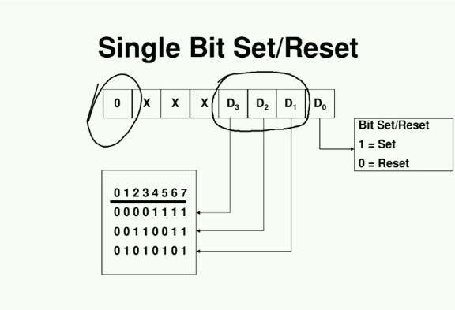


# DMA - Direct Memory Access
E' la risposta quando delle periferiche devono trasferire moli significative di dati.
Il DMA Controller e' un'ulteriore periferica che puo fare accesso diretto alla memoria e alle periferiche senza scomodare la CPU.


## Fasi del DMAC
- Interagisce con la periferica
- Sposta dati dal registro della periferica in memoria e viceversa
- Avvisa la CPU quando ha finito.


## Struttura del DMA


### Registri del DMA
- **DC** - Data Count: C'e' scritto quanti dati deve spostare
- **IOAR** - IO ADDRESS: Indirizzo di memoria in cui andare a scrivere o leggere i vari dati
- **Control** - Tra i vari bit ce ne sara' uno dedicato alla scelta tra rd/wr e un altro/altri dedicati alla scelta del metodo di trasferimento

Quindi ogni volta che la CPU vuole che il DMA trasferisca un blocco questi registri dovranno essere programmati (e non solo nella fase di boot)

In tutti i metodi di funzionamento il DMAC si accorge che il trasferimento e' finito perche decrementa **DC** fino a 0; e in tutti i casi informa la CPU che il trasferimento e' terminato attraverso una richiesta di **interrupt**

### Periferiche
Il DMAC e' direttamente in collegamento con una periferica. Quindi per pilotare piu' periferiche avremo bisogno di avere quei 3 registri per ogni periferica.


## Modi di funzionamento

### Trasferimento a blocchi - BURST TRANSFER
Quando il processore programma i 3 registri del DMAC per pilotare una periferica, il DMAC si mette in attesa di un segnale da parte della periferica che avvisa di essere pronta per lo scambio di dati.
A qusto punto il DMAC per effettuare lo scambio deve leggere il dato dal registro della periferica e andarlo a scrivere in memoria. Per fare cio' avra' bisogno di prendere il controllo del bus, e che la CPU non puo' utilizzarlo. Quindi quando la periferica avvisa che e' pronta, il DMA manda un segnale di **DMA REQUEST** alla CPU per farle lasciare il bus. La cpu lo lascia il controllo al DMA e gli manda un sengale di **DMA ACKNOWLEDGE**. Appena finito (il DMAC si accorge che il trasferimento e' finito perche decrementa *DC* fino a 0) il DMAC manda un segnale di interrupt alla cpu per avvisarla di aver terminato e chiedere se ha bisogno di un nuovo trasferimento.

Questo metodo puo' andare bene ed e' conveniente solo se i blocchi sono di dimensione ridotta o quando la cpu ha lunghi periodi in cui non accede al bus (perche usa la cache) o se mi va bene che la cpu abbia lunghi periodi di idle non potendo usare il bus. In questi casi usare il *burst transfer* va benissimo.

##### Vantaggi
- Massima velocita' di trasferimento

##### Svantaggi
- CPU bloccata per lunghi periodi di tempo


### Trasferimento con CYCLE STEALING
Le prime fasi si svolgono come nel trasferimento a blocchi, con la differenza che il DMAC non impegnera' il bus per lunghi periodi di tempo perche' invece che spostare l'intero blocco, ne spostera' una piccola porzione e poi chiede alla CPU se ha bisogno del bus. Se ne ha bisogno sposta il dato che gli serve in cache e ritorna il controllo al DMAC altrimenti il DMAC continua a trasferire i dati.

##### Vantaggi
- CPU non bloccata per lunghi periodi di tempo

##### Svantaggi
- Maggiore complessita' del DMAC
- La velocita' di trasferimento e' minore


### Trasferimento in TRANSPARENT DMA
E' basato sul fatto che ci possono essere lunghi periodi in cui la CPU non fa accesso al bus. Per evitare di sprecarli la CPU puo' avvisare che non sta facendo accesso al bus e lasciare che il DMAC faccia il suo compito. In questo modo il DMAC lavora **SOLO** nei periodi in cui la CPU non ha bisogno del bus.

##### Vantaggi
- La CPU non e' praticamente rallentata dal DMAC

##### Svantaggi
- Il trasferimento potrebbe durare molto a lungo se la CPU ha intensivamente bisogno del bus
- Non sempre supportato


## Arbitraggio del bus
Il DMAC e' uno dei dispositivi che possono divenire **Master** del bus, e solo un dispositivo alla volta puo' essere master del bus. Percio' nel caso esistano diversi DMAC (o anche nel caso di un processore multicore) e' necessario aggiungere della circuiteria per la gestione dei conflitti sul bus.


# ECCEZIONI
Sono richieste di interrupt che *provengono dall'interno della CPU* (magari per problemi, tipo divisione per 0, o anche l'int 21h per input/output e' un eccezione) che vengono gestite esattamente come gli interrupt periferici (la CPU accede alla *Interrupt Vector Table* ed esegue la *Interrupt Service Routine* corrispondente all'indice dell'interrupt)

## Categorie di eccezioni
- Interrupt di I/O (esterni, alcune volte fanno parte delle eccezioni, altre no)
- Eccezioni di **errore** (es. divisione per 0)
- Eccezioni di **debug** (Utilizzate dai debugger per andare avanti nei programmi di un singolo step o settare breakpoint)
- Eccezioni di **privilegio** (es. registro di sistema che dice se ci troviamo in modalita' utente o amministratore, e se viene chiamata una funzione riservata all'amministratore in modalita' utente, viene scatenata un'eccezione di privilegio)

PS. Per quanto riguarda il debug, molti processori prevedono una modalita' **TRACE**: quando questa viene attivata il processore scatena un'eccezione di debug dopo l'esecuzione di ogni istruzione.


# BUS SINCRONI E ASINCRONI

## Caratteristiche
- Interconnette due o piu' dispositivi
- E' una struttura **CONDIVISA**: i valori che un dispositivo scrive sul bus sono accessibili a tutti gli altri dispositivi connessi

## Connessione con le unita'
Le unita' connesse al bus utilizzano 2 tipi di dispositivi:
- *Driver* per pilotare le linee del bus (dotato di buffer tri-state per la possibilita' di *staccare* l'unita' dal bus
- *Receiver* per leggere i valori sul bus

In genere questi due dispositivi sono ragguppati in un'unica entita' denominata **TRANSCEIVER**

## Implementazione
Un bus puo' essere implementato in diversi modi:
- Interno ad un singolo circuito integrato
- Per la connessione di piu' circuiti integrati su una scheda
- Per la connessione di piu' schede in un sistema (bus di *backplane*)

## Struttura segnali
Un bus e' composto da 3 tipi di segnali:
- Segnali di **dato**: sono in genere 8 o un multiplo e possono essere bidirezionali o unidirezionali (ne servira' un numero doppio in questo caso)
- Segnali di **indirizzo**: identificano lo slave con qui il master vuole comunicare
- Segnali di **controllo**: forniscono informazioni di stato, di temporizzazione e del tipo di dati sul bus

Dal punto di vista fisico pero' a volte questi 3 tipi di segnali sono integrati sulle stesse linee fisiche, questo puo' essere gestito tramite un protocollo che fa passare i diversi tipi di segnali in tempi diversi; ovviamente le periferiche devono essere a conoscenza di questo protocollo per gestirlo al meglio. Questi vengono detti **BUS MULTIPLEXATI**. Ovviamente questo richiede una circuiteria apposita che switcha tra i vari tipi di segnali.


## Esempio: bus di un sistema 8086

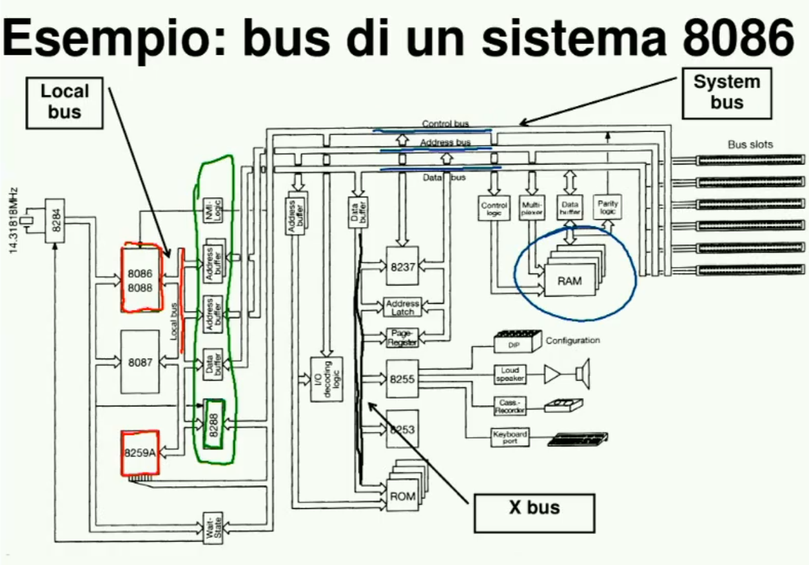

- L'8086 usa un bus multiplexato
- Per interfacciare questo bus (**Local bus**) con il bus di sistema (**System bus**) abbiamo bisogno di un po di circuiteria (quella cerchiata in verde)
- Il bus di sistema e' diviso in 3 parti (*Indirizzi - Dati - Controllo*) (come spesso accade) e quindi la struttura logica coincide con la struttura fisica
- L'**Xbus** e' il bus dedicato alle periferiche (diverso dagli altri perche su 8 bit invece che 16)


## Standard
Per lo sviluppo di dispositivi compatibili sono stati introdotti degli standard a livello di bus che ne descrivono le caratteristiche a diversi livelli:]
- *MECCANICO*: Ad es il numero di linee, il tipo di connettori ecc
- *ELETTRICO*: Ad es i valori delle tensioni e correnti di riferimento
- *LOGICO/FUNZIONALE*: Ad es il significato dei vari segnali e la sequenza di valori che devono assumere per eseguire ciascuna operazione

Esempi di standard sono: *Multibus, PCI, VME, EISA, Futurebus+, SCSI*


## Architetture di bus
- *BUS SINGOLO*: Singolo bus sia per CPU e memoria che per i periferici
- *BUS MULTIPLO*: Es. Formato da bus diversi, un bus piu veloce per CPU e memoria e un bus per i periferici. Per gestire questi due livelli di bus in genere viene introdotto un nuovo dispositivo chiamato **BRIDGE** che permette la comunicazione tra un bus e l'altro

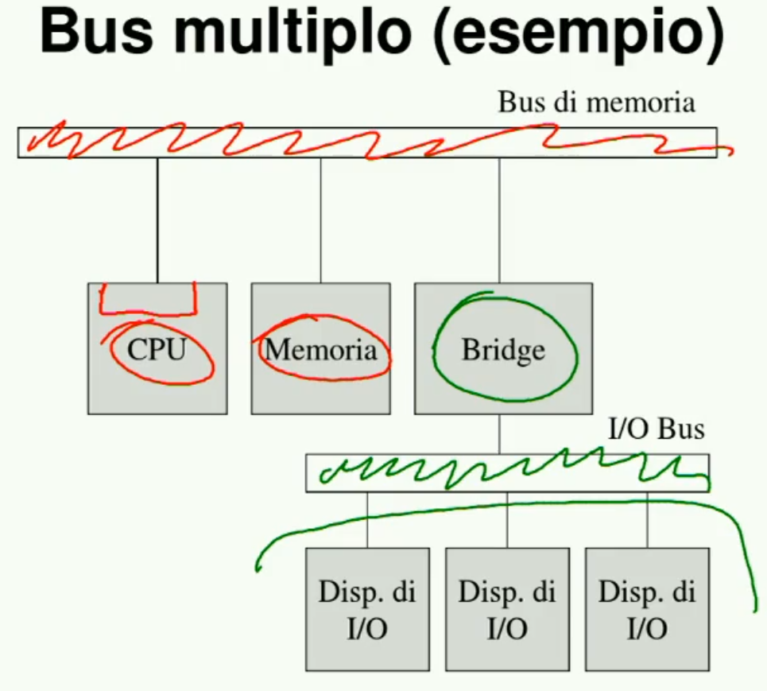


## Master e Slave
La comunicazione su un bus avviene prevedendo che ci sia un'unita' che a un certo punto prende il controllo del bus e decide il tipo di operazione che verra' eseguita subito dopo. Nei sistemi visti finora il master e' sempre la CPU, lo slave puo' essere la memoria o l'interfaccia di un periferico che risponde al master ed esegue l'operazione richiesta.

## Problemi nella gestione del bus

### Tempistiche
Definizione delle tempistiche con cui si svolgono le operazioni sul bus: cioe' bisogna comunicare alle periferiche o alle strutture di controllo collegate al bus *quando* effettuare l'operazione richiesta. 
Questo problema ammette due soluzioni:
- Bus **SINCRONI**
- Bus **ASINCRONI**

#### Bus sincroni
Questa soluzione e' accettabile quando l'unita' sorgente e la destinazione utilizzano lo **stesso segnale di clock** utilizzato per sincronizzarle.
In questo modo possiamo definire il *timing* delle operazioni su bus. 
Ad esempio possiamo decidere che ogni operazione sul bus impiega due segnali di clock: nel primo avviene il trasferimento dell'indirizzo e nel secondo avviene il trasferimento dei dati. 
In questo modo il problema e' risolto perche sia la CPU che le periferiche sanno quando effettuare le operazioni, quando leggere gli indirizzi e quando trasferire i dati.

Il problema e' che per definire la frequenza di clock dobbiamo controllare la frequenza di tutte le periferiche collegate al bus e utilizzare come segnale di clock comune quello della periferica piu' lenta; quindi la frequenza a cui avvengono le operazioni e' imposto dalla periferica piu' lenta; il che e' accettabile se tutte le periferiche collegate al bus hanno piu' o meno lo stesso clock, altrimenti no.

Un altro problema e' che questo segnale deve andare a **tutti** i moduli, quindi puo' essere problematico collegare questo segnale a tutti i moduli collegati; inoltre il segnale alla periferica piu' lontana in caso di una scheda molto grande potrebbe arrivare con un certo ritardo; in questo modo i dispositivi non sono piu' sincronizzati tra loro.

**In sintesi** un bus sincrono puo' essere utilizzato solo quando:
- I moduli collegati al bus sono caratterizzati tutti piu' o meno dalla stessa frequenza
- Possiamo garantire che il segnale di clock arrivi a tutti i moduli contemporanemente e che quindi non ci siano ritardi

##### Cicli di wait
Puo' succedere inoltre che in alcuni casi delle periferiche abbiano bisogno di piu' tempo per eseguire le operazioni (es. nel caso di ram dinamica, non abbiamo un tempo di accesso fisso, ma se ci troviamo nella fase di rinfresco della memoria il tempo di accesso puo' essere molto piu' lungo del solito, e non possiamo neanche abbassare il segnale di clock al caso peggiore perche cosi rovineremmo le prestazioni). 
Abbiamo bisogno percio' di un meccanismo che possa informare la CPU che la periferica ha bisogno di piu tempo per effettuare l'operazione sul bus e questo viene risolto tramite l'introduzione di un nuovo segnale **READY** che chi risponde alla CPU manda quando il dato e' pronto per essere letto/scritto dal/sul bus. 
Se quindi magari si incappa nel ciclo di rinfresco il controllore di memoria ritarda il segnale di ready e la CPU entra in un ciclo di attesa finche non riceve il segnale di ready e sa che il trasferimento e' concluso. Questi cicli di attesa vengono chiamati **CICLI DI WAIT**


#### Bus asincroni
I bus asincroni cercano di risolvere i problemi dei bus sincroni ponendosi come obiettivo di comunicare con le varie periferiche occupando il bus solo per il tempo necessario. Questo viene fatto mediante appositi segnali di controllo chiamati segnali di **HANDSHAKING**. Ogni operazione viene accompagnata da questi segnali con i quali si accordano sulle tempistiche dell'operazione.
Es. Il master decide che un certo modulo deve mandare un dato a un altro modulo. Il modulo sorgente mette quindi sul data bus il dato e manda un segnale di handshaking (in genere chiamato **STROBE**) al modulo destinazione che sa che a questo punto puo' leggerlo. Una volta letto manda un segnale (**ACKNOWLEDGE**) al sorgente con cui lo informa che ha letto il dato e che puo' andare avanti. 

Il vantaggio e' che cosi' ogni periferica occupera' il bus soltanto per il tempo necessario; il rovescio della medaglia e' che sia la CPU che le periferiche devono essere in grado di inviare e ricevere questi segnali di handshaking e questo si traduce in una maggiore complessita' dei moduli.


### Arbitraggio
Il problema si pone ogni volta che il bus e' collegato a piu' di un dispositivo master e quindi bisogna trovare un modo per fare in modo che ad ogni istante ci sia un solo dispositivo master che controlla il bus.
L'arbitraggio puo avvenire in due modi:
- **CENTRALIZZATO**: Esiste un arbitro che decide per tutti
- **DISTRIBUITO**: Ogni modulo contiene la logica necessaria ad implementare il meccamismo di arbitraggio che permette di definire il nuovo master senza bisogno di un arbitro.

#### Distribuito
Prevede che i vari moduli che possono diventare master si scambiano delle informazioni, si capisce chi e' quello a priorita' massima, e solo lui prendera' il controllo.

##### Il bus SCSI
E' un bus con arbitraggio distribuito che permette la comunicazione tra i periferici e un modulo che verra' poi connesso alla cpu. Non comunica quindi direttamente con memoria o cpu, ma solamente tra questo controller dei periferici e i periferici stessi. 
In questo bus c'e' un segnale di **BSY** (busy) che dice quando e' in corso una transazione e quindi il bus e' occupato. 
Quando il sengale di BSY diventa inattivo, i periferici che hanno bisogno del bus devono fare richiesta tramite le 8 linee del bus che sono collegate ognuna ad una periferica diversa. (Le stesse linee che quando BSY e' attivo vengono utilizzate per il trasferimento dei dati).
Gli 8 moduli potenziali master possono leggere i valori di tutte le linee, e dopo aver fatto richiesta si sceglie chi e' quello a priorita' massima.
La priorita' e' gestita semplicemente tramite l'ordine delle linee, quindi la periferica associata alla linea 7 avra' priorita' massima. Quindi tutti quelli che hanno tirato su la loro linea per richiedere il controllo del bus controllano se una periferica con indice maggiore ha attivato la sua linea; in questo caso la periferica con priorita' minore non fa nulla, mentre quella che non vede nessuna linea attiva con indice maggiore, tira  su il segnale di BSY e inizia a lavorare sul bus.

#### Centralizzato
Esistono 3 meccanismi di arbitraggio centralizzato:
- **DAISY CHAINING**
- **POLLING**
- **RICHIESTE INDIPENDENTI**

Questi differiscono per:
- Numero di linee di controllo richieste
- Velocita' di risposta del bus controller
- Flessibilita' nella gestione delle priorita'
- Tolleranza ai guasti

##### Daisy Chaining
###### Struttura
- Una sola linea per il **Bus Busy**
- Una sola linea per il **Bus Request**
- Una linea di **Bus Grant** che collega l'arbitro al primo dispositivo, il primo al secondo ecc.. (in cascata)

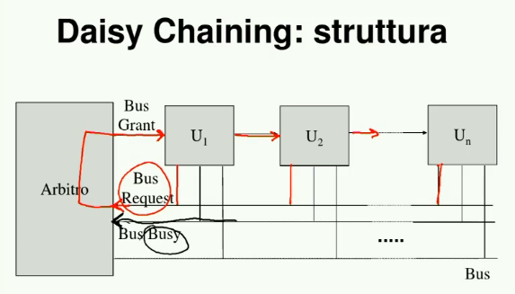


###### Funzionamento
Appena il *bus busy* va a 0, tutti quelli che vogliono prendere il controllo del bus mandano il *bus request*, in questo modo, essendo una sola linea per il *bus request*, l'arbitro sa che c'e' qualcuno che vuole prendere il controllo del bus, ma non sa chi. Allora l'arbitro manda un segnale di *bus grant* al primo dispositivo, se il primo ha fatto richiesta tira su il *bus busy* e prende il controllo del bus, altrimenti attiva il *bus grant* verso il secondo dispositivo e avanti cosi.

###### Vantaggi
- Solo 3 linee coinvolte (*request, busy, grant*)
- L'arbitro e' semplicissimo (quando vede il bus request attiva il bus grant)

###### Svantaggi
- Priorita' fisse
- La velocita' (Nel caso peggiore in cui il controllo del bus viene preso dall'ultimo dispositivo in cascata il segnale deve passare per tutti i dispositivi, il che potrebbe richiedere un certo tempo)
- Se un solo dispositivo smette di funzionare, anche tutti quelli che sono collegati in cascata non funzioneranno perche non potranno ricevere il segnale di *grant*

##### Polling
###### Struttura
- **Bus busy** come nel daisy chaining
- **Bus request** come nel daisy chaining
- Linee di **Poll Counter** di numero pari a *log2(n)* con *n* numero di dispositivi connessi

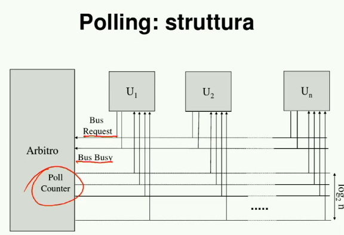

###### Funzionamento
Ogni modulo ha il suo indice; quando il bus request va a 1 scrive un codice (indice del dispositvo) (ad esempio 0) sul poll counter; facendo cio' lui sta chiedendo al dispositivo 0 se ha fatto richiesta e se entro un certo tempo il dispositivo 0 tira su il segnale di bus busy allora sara' lui a prendere il controllo del bus, altrimenti l'arbitro mette un nuovo codice sul poll counter e il dispositivo corrispondente potra' rispondere entro un certo tempo e cosi' via.

###### Vantaggi
- La priorita' dipende dall'ordine in cui vengono scanditi i dispositivi, che dipende dall'arbitro. Quindi magari posso avere un arbitro elaborato che prima scandisce i dispositivi in un senso e poi in un altro o robe del genere.
- Un dispositivo che smette di funzionare non influisce sul funzionamento degli altri

###### Svantaggi
- Siamo passati da 3 linee a *2 + log(n)* (che comunque non sono tantissime)
- Velocita' come il daisy chaining

##### Richieste indipendenti
###### Struttura
Per *n* dispositivi:
- *n* linee di **Bus Request**
- *n* linee di **Bus  Grant**
- Una sola linea di **Bus Busy**

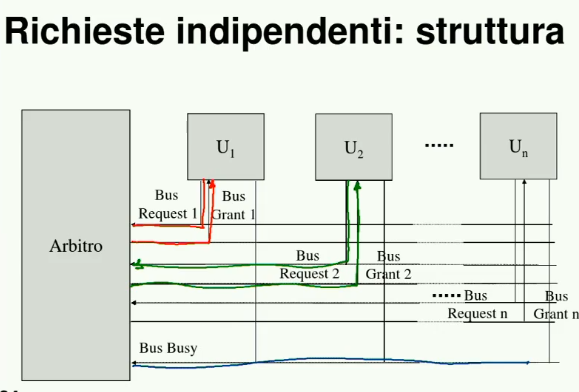

###### Funzionamento
Quando il *bus busy* va a 0, l'arbitro si vede arrivare tutte le richieste di *bus request* e sa da chi provengono, sara' quindi lui a decidere a chi dare priorita' e quindi a chi mandare il segnale di *bus grant*

###### Vantaggi
- Priorita' variabili decise dall'arbitro
- Velocita' maggiore rispetto agli altri due metodi perche non c'e' bisogno di scandire le periferiche
- Come nel polling un dispositivo che smette di funzionare non influenza il comportamento degli altri

###### Svantaggi
- *2n+1* linee 


# 8259 - PROGRAMMABLE INTERRUPT CONTROLLER (PIC)
Progettato per minimizzare il software e i tempi di risposta per la gestione di livelli multipli di interrupt a diverse priorita'. Raccoglie quindi le diverse richieste di interrupt provenienti dai periferici e inoltra alla CPU le richieste in ordine di priorita'

Puo' gestire fino a 8 periferiche e supporta il collegamento di piu' controllodi di interrupt *in cascata* fino ad un massimo di 64 periferiche

## Funzioni
- Mascheramento di una periferica: cioe' e' in grado di ignorare tutte le richieste di interrupt provenienti da una determinata periferica e di non inoltrarle alla CPU
- E' in grado durante una *ISR* (Interrupt Service Routine) di accettare richieste di interrupt dai dispositivi che hanno priorita' piu' alta e di ignorare quelle dei dispositivi con priorita' piu bassa. 

PS. L'8086 e' invece solo in grado di abilitarle o disabilitarle del tutto. Di default sono disabilitate durante una *ISR*, ma il programmatore puo' decidere di abilitarle aggiungendo una **STI** (Setta l'interrupt flag **IF** a 1) all'inizio della *ISR*.

## Struttura
Segnali:
- 8 linee collegate alle periferiche (IR0 - IR7)
- 1 linea di **Interrupt Request INTR** in uscita verso la CPU
- 1 linea di **Interrupt Acknowledge INTA** in entrata dalla CPU
- 8 linee collegate al **Data Bus** attraverso le quali l'8259 scrivera' l'indirizzo della procedura da eseguire sul bus
- Segnali di read/write
- Segnale di **Chip Select** per attivare l'8259
- Segnale di indirizzo **A0**

Registri:
- **Interrupt Mask Register - IMM**: registro che gestisce il *mascheramento* delle periferiche
- **Interrupt Request Register - IRR**: registro che dice all'8259 quali sono le richieste pendenti
- **In Service Register - ISR**: tiene conto di quali sono le periferiche la cui procedura di servizio e' in esecuzione


- **Priority resolver**: decide cosa fare a seconda di quali sono le richieste pendenti e quali sono le periferiche le cui procedure sono in corso di esecuzione

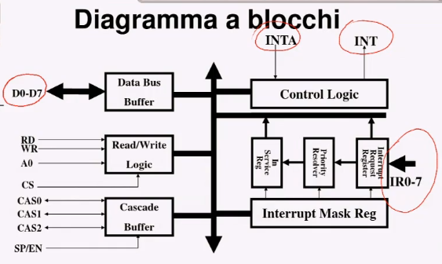

## Procedura di interrupt
- Una linea di richiesta di interrupt diviene attiva e viene settato il corrispondente bit del registro **IRR**
- L'8259 valuta la richiesta (controlla se la periferica e' mascherata o se e' in corso una ISR di una periferica con priorita' maggiore) e manda eventualmente un segnale di 
**INT** alla CPU
- La CPU conferma la richiesta e invia un primo segnale di **INTA** all'8259
- La richiesta a priorita' piu' alta viene selezionata settando l'opportuno bit del registro **ISR** e resettando il corrispondente bit del registro **IRR**
- La CPU manda un secondo impulso di **INTA** che dice all'8259 di mettere sul *Data Bus* il codice del dispositivo che ha fatto richiesta
- L'8259 mette il codice sul *Data Bus*
- Il ciclo di interrupt e' concluso resettando il bit ISR
	- In modo **AEOI** (Automatic End Of Interrupt) cio' avviene in modo automatico
	- In alternativa il programmatore deve mandare un istruzione di **EOI** (*End Of Interrupt*) per informare che la procedura di servizio e' finita
- L'8086 a questo punto attiva la procedura di servizio dell'interrupt (*ISR*)

## Programmazione
Avviene attraverso due tipi di comandi (valori che vado a scrivere nei due registri):
- ICW - Initialization Command Word (Parola che vengono inviate una sola volta in fase di inizializzazione
- OCW - Operation Command Word (Parole che possono essere inviate singolarmente in qualunque fase del programma)

### ICW
Le *ICW* devono essere mandate come prima cosa all'8259, quando gli arriva la ICW1 caratterizzata come vedremo, lui la riconosce e si aspetta nel giusto ordine anche le altre *ICW* prima di poter accettare altri comandi (*OCW*)

#### ICW1
Riconoscibile da:
- Bit A0 a 0
- Bit di dato D4 a 1

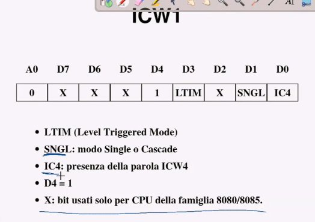

#### ICW2
Dice all'8259 il codice delle 8 periferiche collegate che e' cosi gestito:
- I 5 bit alti sono tutti uguali
- I 3 bit bassi sono invece determinati dalla linea a cui e' collegata la periferica (che quindi avranno codici in sequenza)

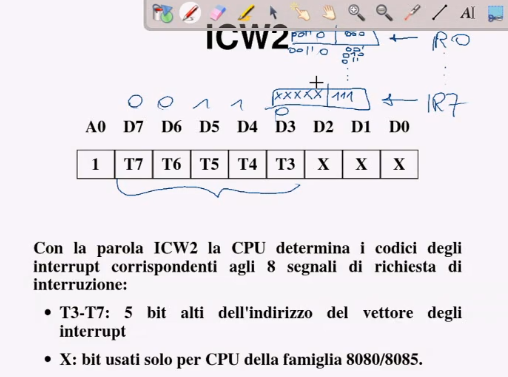

#### ICW3
Serve solo nel caso in cui ci siano piu' dispositivi 8259 in cascata, ma non ci interessa quindi per noi e' piena di zeri

#### ICW4
Pure questa non ci interessa


### OCW
#### OCW1
Serve per indicare all'8259 quali periferiche mascherare
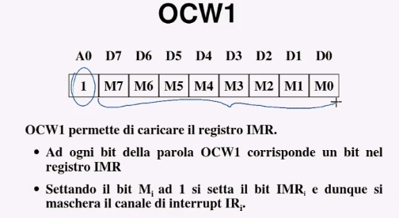

#### OCW2
Serve per modificare le priorita' dei vari dispositivi connessi (se nei primi 3 bit scriviamo 110)
Di default le priorita' dei dispositivi partono da IR0 che ha priorita' massima fino a IR7 che ha priorita' minima.
Attraverso la OCW possiamo modificare queste priorita' e indicare quale sara' la nuova periferica che avra' priorita' massima; se ad esempio indichiamo IR5, IR5 avra' priorita' massima, IR6 subito dopo, fino ad arrivare ad IR4 che avra' priorita' minima

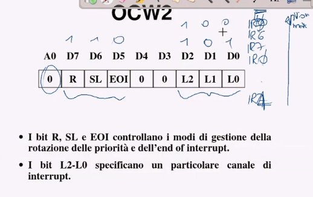


Se invece scriviamo nei primi 3 bit 101 avremo **PRIORITA' ROTANTI** nel senso che quando l'8259 serve una periferica (ad esempio la periferica 5) quella subito dopo assumera' priorita' minima (e la IR6 priorita' massima)

Altre opzioni:

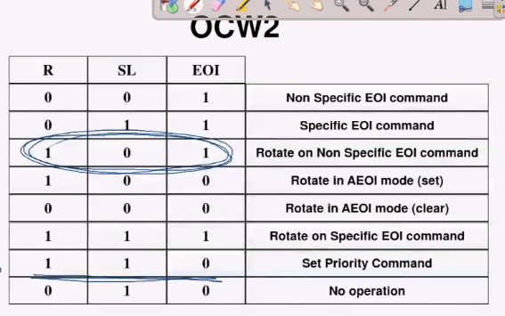

#### OCW3
Serve per informare l'8259 quando ha finito una procedura di servizio, ma non scendiamo nel dettaglio


# MEMORIA VIRTUALE
Es. processore con 32 bit di indirizzo, quindi ha 4 gb di ram massima. Magari pero' non vogliamo metterci 4 gb di ram, quindi noi facciamo credere al processore di avere 4gb di memoria virtuale, ed emette indirizzi su 4gb, e questo sistema di memoria virtuale accede alla memoria principale e serve il processore. La maggior parte delle volte il dato di cui la cpu ha bisogno lo troviamo in memoria principale. In altri rari (auspicabile) casi questo dato si trova in memoria secondaria (potrebbe succedere proprio perche' abbiamo meno memoria di quanta ne crede il processore).

Il principio e' basato sul prevedere a quali blocchi fara' accesso il processore sfruttando il principio della localita' dei riferimenti.

Questo sistema utilizza il **Memory Management Unit - MMU** per trasformare gli indirizzi logici (che utilizzano il 
massimo della memoria virtuale) in indirizzi fisici con il quale poi si accede alla memoria principale. Se il blocco richiesto non e' presente in memoria principale, l'MMU dice al processore di caricarlo in memoria principale. L'OS dopo averlo fatto aggiorna l'MMU che ottiene l'indirizzo fisico a cui accedere. Per l'MMU l'hit rate e' molto piu' elevato di quello della cache, anche perche' in caso di miss la penalita' da pagare e' molto piu alta.

Quindi:
- La traduzione da indirizzo logico a indirizzo fisico e' fatta dall'**MMU** in hardware perche abbiamo bisogno di velocita'
- In caso di *MISS* (**PAGE FAULT**) lo spostamento dei dati dalla memoria secondaria alla memoria principale 
e' invece affidato al sistema operativo

## Suddivisione in pagine
Vista la localita' dei riferimenti conviene fare in modo che la memoria sia divisa in blocchi dette pagine e che ogni volta che la cpu fa un accesso a un dato in una pagina non contenuta in memoria principale, l'intera pagina vi venga spostata (di solito utilizzando il meccanismo del DMA)
A differenza dei blocchi di cache le pagine sono relativamente grandi (tra 1KB e 64KB).

## Memory Address Table MAT
L'*MMU* divide la memoria in pagine, quindi a seconda di quanto e' grande la memoria puo' dividere l'indirizzo in una parte piu' significativa che indica l'indirizzo della pagina e una parte meno significativa dell'indirizzo che indica la posizione del dato nella pagina. (Indirizzo diviso in **NUMERO DI PAGINA** e **OFFSET** all interno della pagina).
Utilizza una tabella detta **Memory Address Table (MAT)**, che per ogni pagina presente in memoria virtuale c'e' scritto dove si trova nella memoria fisica (l'indirizzo in memoria principale o se non e' presente, in memoria secondaria).

### TLB
La *MAT* essendo molto grande si trova in memoria principale e questo potrebbe sembrare un controsenso (doppio accesso alla memoria principale per evitarne uno), ma per rendere efficiente il tutto basta usare una cache all'interno dell'*MMU* con all'interno le parti della *MAT* utilizzate recentemente (scelte tramite il principio di localita' dei riferimenti); in questo modo fara' raramente accesso alla *MAT* completa. Questa cache viene chiamata **Translation Lookaside Buffer (TLB)**.

## Vantaggi
- L'utilizzo della memoria virtuale rende i programmi indipendenti (dal punto di vista funzionale) dalla configurazione reale di memoria del sistema e dalla posizione dei dati in memoria.
- Fa si che i programmi vedano una memoria complessiva molto ampia, con tempi di accesso ridotti e con basso costo per bit.
- Permette un uso efficiente della memoria in ambienti multi-utente.

## In sintesi
- L'**MMU** si occupa di trasformare **in hardware** gli indirizzi logici in indirizzi fisici servendosi della *MAT*
- La **MAT** e' una tabella che associa ad ogni blocco presente in memoria virtuale il suo indirizzo nella memoria principale, se presente, altrimenti gli associa la sua posizione nella memoria secondaria


## Memoria virtuale VS Cache
Benche' vi siano molti elementi di somiglianza tra la memoria virtuale e la cache, elenchiamo ora le caratteristiche che differenziano il rapporto tra cache e memoria da quello tra memoria virtuale e memoria
- Rapporto nei tempi di accesso 5:1 (in realta' il numero varia tra 2 e 10) per la cache contro i 1000:1 (o anche di piu') della memoria virtuale
- La cache e' realizzata solamente in hardware, mentre la memoria virtuale lavora con il supporto del sistema operativo
- Dimensioni delle pagine: tra 4 e 32 byte per la cache e tra 1 e 64 KB per la memoria virtuale


# ISTRUZIONI MACCHINA E TEMPI DI ESECUZIONE

## Formato del codice macchina
Per i processori della famiglia x86 non esistono regole generali per la traduzione delle istruzioni dal linguaggio sorgente al codice macchina, ma per ogni istruzione si hanno regole specifiche. E' uno dei processori con il codice macchina piu' irregolare e complicato, ed e' uno dei difetti dell'x86

### Numero di byte
Il codice macchina delle istruzioni ha una dimensione che varia da 1 a 6 byte.
- 1 o 2 byte per specificare il codice operativo ed il modo di indirizzamento
- da 0 a 4 byte aggiuntivi contenenti eventuali offset in memoria o valori immediati


#### Primo byte
Oltre al codice operativo il primo byte puo' contenere alcuni bit con significato particolare:
- **W**: se vale *0* l'istruzione lavaora su byte, se  vale 1 lavora sulle word
- **D**: ci dice se il registro che compare nell'istruzione e' l'operando sorgente (D=0) o destinazione (D=1)

#### Secondo byte
Dipende moltissimo dal tipo di istruzione ma in genere specifica gli indirizzi degli operandi coinvolti e il modo in cui vengono utilizzati (se bisogna prendere il valore del registro o magari leggere l'indirizzo nel registro e prendere il valore in memoria e co)
- *reg*: registro
- *r/m*: registro o memoria
- *mod*: modo di indirizzamento


## Tempi di esecuzione
Il tempo per l'esecuzione di una istruzione dipende:
- dalla frequenza di clock
- dal tipo di istruzione
- dalla posizione degli operandi (registro/memoria/immediati)
- dall'allineamento degli operandi in memoria (se l'operazione e' su 16 bit e l'operando in memoria ha indirizzo dispari ci vorranno il doppio degli accessi in memoria rispetto a indirizzo pari)

Il tempo  richiesto puo' essere cosi scomposto:
- Il tempo per il caclolo dell'**EA** (*Effective Address*) dell'eventuale operando in memoria
- Il tempo per l'accesso a tale operando
- Il tempo per l'esecuzione


# ARCHITETTURE A PIPELINE
Verso la fine degli anni 70' ci si rende conto che l'architettura delle cpu cosi com era stata pensata fino a quel momento poteva portare a dei problemi. La richiesta di  aumento delle prestazioni veniva fatto con 
l'evoluzione della tecnologia senza ricorrere a modifiche dell'architettura. Questo trend portava a dei processori sempre piu' complessi (CISC, per essere ottimizzati veniva ampliato il set di istruzioni e le funzioni utilizzate piu' spesso supportate anche in hardware rendendo il tutto piu' veloce ma anche piu complesso.) 

In quegli anni si inizia a pensare a un rinnovamento nell'architettura, cercando qualcosa che rendesse piu' efficiente il tutto. Si cerca un modo per parallelizzare le operazioni di fetch di un istruzione, esecuzione e fetch della successiva.

## Pipeline
Equivalente elettronico della catena di montaggio. 


Queste 4 fasi possono variare a seconda a del processore, es:
- *ARM* 3 fasi
- *PENTIUM 4* 31 fasi


## CPI
Per misurare l'efficienza di un processore si usa a volte un parametro **CPI** (*Clocks Per Instruction*)
- Per processori CISC -> CPI > 1
- Per processori RISC -> CPI ~ 1 (**PIPELINE**)
- Per processori superscalari -> CPI < 1


## Problemi

### Stallo
Se una delle fasi ha bisogno di piu' tempo per essere eseguita, in questo caso:
- Gli altri stadi a monte devono arrestarsi, cioe' andare in **stallo** ed attendere che la fase venga eseguita
- Gli altri stadi a valle continuano a lavorare ma solo per smaltire le istruzioni gia' processate dallo stadio critico.

#### Cause
- Accesso in memoria in una delle fasi (*Fetch*, *Decode*, *Write*)
- Operazione da eseguire complessa (fase di *Operate*)

#### Soluzioni

##### Coda delle istruzioni
Per evitare che in caso di miss nella fase di fetch si blocchi l'intera pipeline introduciamo una **Coda delle istruzioni**:
In pratica non facciamo il fetch di una sola istruzione, ma tipo di 2 o 3 mettendole in una coda FIFO. In questo modo in caso di *miss* del fetch, la fase di *decode* non dovra' fermarsi perche' avra' ancora delle istruzioni da eseguire in coda. Cosi' facendo riduciamo i tempi morti del processore.


### Dipendenze di dato
Se ad esempio ci sono due operazioni aritmetiche successive e la seconda ha un operando che dipende dall'operazione precedente, si puo' creare un problema nella pipeline, perche il decode degli operandi della seconda istruzione verra' fatto prima che venga eseguito il write dell'istruzione precedente, finendo cosi per avere un risultato sbagliato.

#### Soluzioni

##### Hardware
L'hardware della pipeline e' in grado di riconoscere dipendenze di dato e di imporre degli stalli per attendere che venga scritto il valore corretto su cui operare.

##### Software
Il compilatore introduce delle istruzioni **NOP** (Istruzioni fittizie utilizzate come degli stalli) che permettono alla pipeline di produrre un risultato corretto.


### Istruzioni di salto
Subito dopo un istruzione di salto verrano caricate in pipeline alcune istruzioni che non dovranno essere eseguite a causa del salto (carica sul PC l'indirizzo a cui saltare solo nella fase di *write*).

#### Soluzioni

##### Hardware
Consiste nel rilevare in hardware la presenza di un'istruzione di salto, quando la rileva blocca il caricamento di nuove istruzioni finche' non viene aggiornato il PC e nel caso svuota la pipeline dalle istruzioni gia caricate erroneamente. Subito dopo la fase di *write* in cui viene aggiornato il PC, riparte la fase di *fetch* dell'istruzione successiva.

###### Branch Delay Slot
E' il numero di cicli di clock successivi ad un'istruzione di salto in cui il processore eegue il fetch utilizzando un valore sbagliato del PC.

##### Software
Coincide con l'introduzione di un numero di *NOP* pari al *Branch Delay Slot* subito dopo un salto.

###### Ottimizzazione
Con l'implementazione software possiamo ottimizzare le prestazioni spostando le istruzioni precedenti al salto al posto delle *NOP* successive al salto, in questo modo diminuiamo i tempi morti della pipeline.

### Salti condizionati
In questo caso e' necessario attendere l'esecuzione dell'istruzione precedente a quella di salto per sapere se il salto deve essere eseguito o meno. Nel frattempo la coda delle istruzioni viene riempita, percio' 
se il salto poi deve essere eseguito ci sara' un numero di istruzioni da saltare pari a quello del *Branch Delay Slot*


## RISC - Reduced Instruction Set Computer (CPI ~ 1)
Caratterizzati da:
- Elevata semplicita'
- Numero ridotto di istruzioni che abbiano lo stesso formato e la stessa dimensione
- Elevato numero di registri
- Architettura a *pipeline*

### Caratteristiche
- 1 istruzione = 1 ciclo di clock; cioe' ad ogni ciclo di clock termina un'istruzione, non che ogni istruzione richiede un ciclo di clock per essere eseguita
- Istruzioni semplici e regolari
- Le istruzioni RISC hanno la complessita' delle microistruzioni CISC, quindi l'**unita' di controllo** puo' essere realizzata con la tecnica cablata anziche' microprogrammata. (Il che massimizza la velocita')
- Ha due sole istruzioni (*LOAD & STORE*) che accedono in memoria, quindi tutte le altre istruzioni hanno operandi nei registri, il che le rende piu' veloci. (Niente decodifica degli indirizzi e tempo di accesso della memoria)
- I registri sostituiscono lo stack, quindi diminuiscono gli accessi in memoria
- Dal punto di vista delle dimensioni del codice, il codice generato per un RISC ha dimensioni comparabili (forse poco maggiore) a quelle di un CISC perche si il RISC ha piu istruzioni, ma sono piu' corte.
- Nei RISC la latenza di interrupt e' in genere minore grazie alle istruzioni piu' semplici, e sono quindi piu' indicati per applicativi real-time.


## PROCESSORI SUPERSCALARI (CPI < 1)
Processori che in un singolo colpo di clock riescono a completare piu' di un'istruzione.
Sfruttano l'idea di eseguire piu' operazioni in parallelo, ad esempio mettendo due pipeline parallele, idealmente si completerebbero due istruzioni per colpo di clock (idealmente...).

### Struttura
- *Unita' di __FETCH__* in grado di caricare molte (2.. 4 bho) istruzioni per colpo di clock
- *Coda delle istruzioni*
- *Unita' di __DISPATCH__* in grado di capire il tipo di istruzione e mandarla all'unita' di _OPERATE_ opportuna
- *Diverse unita' di __OPERATE__* in grado di lavorare in parallelo

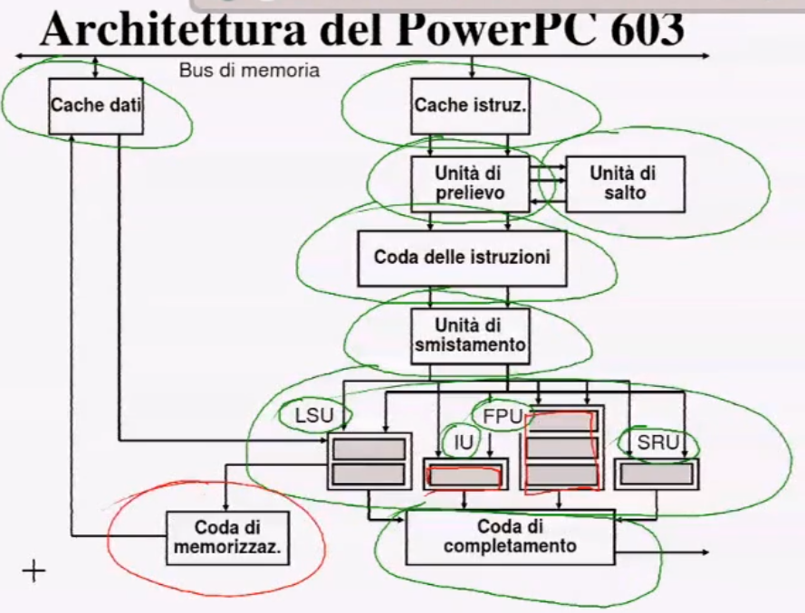

### Problemi

#### Completamento non in ordine
Ovviamente con diverse unita' che lavorano in parallelo, un'istruzione piu' semplice arrivata dopo una piu' complessa potrebbe essere completata prima anche se veniva prima nell'ordine.

Per risolvere questo problema si introduce la **Coda di completamento** che ha il compito di prendere tutte le istruzioni che escono dalle unita' funzionali e di farle attendere per il completamento finche non vengono completate le precedenti.

### Numero di stadi della pipeline
Teoricamente se aumenta il numero di stadi aumentano le prestazioni del processore, ma aumentando il numero di stadi aumenta anche la probabilita' di stalli. Si e' arrivati quindi al rapporto ottimale durante gli anni 2000.

Il passo successivo e' consistito nell'andare a sfruttare altri livelli di parallelismo. Cioe' l'unita' di dispatch ha il compito di cercare le istruzioni piu' indipendenti tra loro da far eseguire in parallelo.

## PROCESSORI MULTITHREAD
Il passo seguente poi sono stati i processori multithread, possiamo immaginre ogni thread come una porzione di programma indipendente,, questi thread quindi possono essere eseguiti in parallelo, aumentando il livello di parallelismo e quindi di prestazioni del processore.


### PROCESSORI MULTICORE
Si e' pensato di integrare all'interno di un unico chip diversi processori di complessita' non troppo elevata che se riescono a lavorare bene in parallelo ottengono un aumento delle prestazioni con bassi consumi.
